# Liens utiles

[Documentation de React Native](https://reactnative.dev/docs/getting-started)  
[Documentation des composants React Native](https://reactnative.dev/docs/components-and-apis)  
[Documentation Flexbox ReactNative](https://reactnative.dev/docs/flexbox)  
[Documentation de la FlatList React Native](https://reactnative.dev/docs/flatlist)  
[Documentation des Hooks](https://fr.reactjs.org/docs/hooks-intro.html)  
[Documentation de react-navigation](https://reactnavigation.org/docs/en/getting-started.html)  
[Documentation API Fetch](https://developer.mozilla.org/fr/docs/Web/API/Fetch_API/Using_Fetch)

[Feuille récap des propriétés pour les styles](https://github.com/vhpoet/react-native-styling-cheat-sheet)

# Get started - CRNA

## Les outils

Installez [Node.js (LTS).](https://nodejs.org/en/download/)

Installez **Expo**:

```
npm install -g expo-cli
```

Installez un **éditeur de texte** pour développer en JavaScript. Je recommande Visual Studio Code mais vous êtes libre de choisir une autre solution (Atom, IntelliJ...).

Si vous êtes sur macOS, il vous faudra également [installer Watchman](https://facebook.github.io/watchman/docs/install#buildinstall).

Sur votre téléphone / tablette, téléchargez **l'application Expo**.
Passez le téléphone en mode développeur.  
Si vous souhaitez utiliser un émulateur Android, installez Android Studio. Vous pouvez suivre [ce tutoriel](https://docs.expo.dev/workflow/android-studio-emulator/) pour configurer votre émulateur.

## Création du projet

Initialisez votre projet (template blank):

```
expo init nomdudossier
```

## Lancer l'application

Placez-vous dans un terminal, dans le dossier de votre projet:

```
expo start
```

Si vous êtes sur le même réseau WiFi, scannez le QR code avec Expo depuis la tablette. Sinon passez en mode tunnel dans l'interface web ouverte par Expo, puis scannez le QR code.

## Menu des options de debug

Pour ouvrir le menu d'options de debug, secouez l'appareil.

## Live reloading

Pas besoin de compiler du JS. Une application React Native se recharge dès que vous faites un changement.

Dans le fichier _App.js_, modifiez:

```
<Text>Open up App.js to start working on your app!</Text>
```

par:

```
<Text>Bonjour à vous les GI</Text>
```

puis sauvegardez. L'application est re-rendu et le changement s'affiche à l'écran.

# Application

## Premier composant

Objectif, réaliser ce composant:


Par convention et réutilisabilité:

- 1 composant = 1 fichier
- nom du fichier contenant un composant commence par une majuscule

Créez un dossier _src_, puis un dossier _components_, puis le fichier _Search.js_ (src/components/Search.js).

Il existe 2 façons pour écrire un composant: l'écrire sous forme de **class** ou sous forme de **function**. Voici un _Hello World_ représentant ces 2 méthodes:

```
//Class

import React, { Component } from 'react';
import { Text, View } from 'react-native';

class HelloWorldApp extends Component {
  render() {
    return (
      <View>
        <Text>Hello, world!</Text>
      </View>
    );
  }
}

export default HelloWorldApp;
```

```
//Function

import React from 'react';
import { Text, View } from 'react-native';

const HelloWorldApp = () => {
  return (
    <View>
      <Text>Hello, world!</Text>
    </View>
  );
}

export default HelloWorldApp;
```

Bien que la forme de class doit être plus familière, cette méthode est déconseillée depuis l'introduction des **Hooks** en mars 2019. Nous verrons cela plus tard, prennez donc l'habitude d'écrire vos composants sous forme de functions.

Notez également l'utilisation d'une **arrow function**:

```
//Function

function myFunction () {
  return 'Hello';
}
```

```
//Arrow function

const myArrowFunction = () => {
  return 'Hello';
}
```

C'est une autre façon d'écrire les fonctions en JS, avec quelques subtilités comme la syntaxe, le contexte ou le passage d'arguments.  
Pour l'instant utiliser une _function_ ou une _arrow function_ ne change rien, mais par la suite cela aura un impact. Par défaut, utilisez **toujours des _arrow functions_ pour écrire vos composants.**

N'oubliez pas d'importer les composants React et React native en premiers dans vos composants. React Native exporte ses composants dans un seul fichier 'react-native'.

```
import React from 'react';
import { View, TextInput, Button } from 'react-native';
```

Il faut maintenant décrire le contenu de notre composant:

```
return (
  <View>
    <TextInput placeholder='Terme à chercher'/>
    <Button
      title='Rechercher'
      onPress={() => { console.log('Coucou'); }}
    />
  </View>
);
```

La propriété _onPress_ attend une fonction à exécuter lors d'un appui sur le bouton. J'ai ici utilisé l'avantage syntaxique des arrow functions, mais j'aurais pu écrire:

```
maFonction = function() {
  console.log('Coucou');
};

...
    <Button
      title='Rechercher'
      onPress={maFonction}
    />
...
```

On termine par exporter notre composant pour l'utiliser dans l'application:

```
export default Search;
```

Import et utilisation dans App.js:

```
import Search from './src/components/Search';

export default function App() {
  return (
    <View style={styles.container}>
      <Search />
      <StatusBar style="auto" />
    </View>
  );
}
```

<details>
<summary>Code complet</summary>

```
//Search.js

import React from 'react';
import { View, TextInput, Button } from 'react-native';

const Search = () => {
  return (
    <View>
      <TextInput
        placeholder="Terme à chercher" />
      <Button
        title="Rechercher"
        onPress={() => { console.log('Coucou'); }} />
    </View>
  );
};

export default Search;
```

```
//App.js

import { StatusBar } from 'expo-status-bar';
import { StyleSheet, View } from 'react-native';

import Search from './src/components/Search';

export default function App() {
  return (
    <View style={styles.container}>
      <Search />
      <StatusBar style="auto" />
    </View>
  );
}

const styles = StyleSheet.create({
  container: {
    flex: 1,
    backgroundColor: '#fff',
    marginTop: 24, // correction barre d'état
  },
});
```

</details>
<br>

Après sauvegarde des fichiers, vous pouvez observer le résultat directement sur votre appareil. J'ai corrigé le soucis avec la barre d'état dans le _style_ du fichier App.js, on verra cela plus tard.

### Exercice: s'entrainer sur un composant custom

Créez un nouveau composant Test.js et faite en sorte d'obtenir le résultat suivant:


<details>
<summary>Correction</summary>

```
//Test.js

import React from "react";
import { View, TextInput, Text, Button } from "react-native";

const Test = () => {
  return (
    <View>
      <Text>Nouvelle recrue</Text>
      <TextInput placeholder="Entrez votre nom" />
      <TextInput placeholder="Entrez votre prénom" />
      <Button title="Ajouter" onPress={() => {}} />
      <Text>Composition de l'équipage :</Text>
    </View>
  );
};

export default Test;

```

</details>
<br>

## Maitriser le style

Les styles permettent de contrôler le rendu graphique des composants. Première approche pour ajouter des styles:

```
const Search = () => {
  return (
    <View style={{ paddingHorizontal: 12, marginTop: 16 }}>
      <TextInput placeholder="Terme à chercher" style={{ marginBottom: 16 }} />
      <Button
        title="Rechercher"
        color="#003482"
        onPress={() => {
          console.log("Coucou");
        }}
      />
    </View>
  );
};
```

A noter que le composant Button n'a pas de propriété _style_. Il faut soit utiliser une propriété existante (ici _color_), soit utiliser un autre composant React Native (_ToucheableOpacity_ par exemple).  
Résultat obtenu:


Une bonne pratique, pour améliorer la lisibilité du code, est d'externaliser les styles du composant. Pour cela il faut utiliser _StyleSheet_:

```
import { ..., StyleSheet } from 'react-native';
```

Il faut ensuite définir les styles du composant, en dehors de ce dernier mais dans le même fichier:

```
const styles = StyleSheet.create({
  container: {
    paddingHorizontal: 12,
    marginTop: 16,
  },
  inputSearchTerm: {
    marginBottom: 16,
  },
});
```

Et enfin les appliquer à nos éléments, en utilisant les noms des variables utilisées à l'étape précédente:

```
const Search = () => {
  return (
    <View style={styles.container}>
      <TextInput
        placeholder="Terme à chercher"
        style={styles.inputSearchTerm}
      />
      <Button
        title="Rechercher"
        color="#003482"
        onPress={() => {
          console.log("Coucou");
        }}
      />
    </View>
  );
};
```

**Gérer les couleurs dans l'application**

La couleur de notre bouton est définie dans ce composant, mais nous allons l'utiliser à plusieurs endroits de notre application. Il faudrait définir une variable une seule fois pour pouvoir l'utiliser au besoin.  
Pour cela, créez un fichier pour gérer l'ensemble des couleurs. Commençez par créer un dossier _src/definitions_ puis un fichier _Colors.js_. Dans ce dernier, créez une variable pour la couleur:

```
//Colors.js

const Colors = {
  primary_blue: "#003482",
};

export default Colors;

```

Il vous reste à importer le fichier dans le composant pour pouvoir utiliser la couleur:

```
...
import Colors from '../definitions/Colors';
...
      <Button
        title="Rechercher"
        color={Colors.primary_blue}
        onPress={() => {
          console.log("Coucou");
        }}
      />
...
```

<details>
<summary>Code complet</summary>

```
//Search.js

import React from "react";
import { View, TextInput, Button, StyleSheet } from "react-native";

import Colors from "../definitions/Colors";

const Search = () => {
  return (
    <View style={styles.container}>
      <TextInput
        placeholder="Terme à chercher"
        style={styles.inputSearchTerm}
      />
      <Button
        title="Rechercher"
        color={Colors.primary_blue}
        onPress={() => {
          console.log("Coucou");
        }}
      />
    </View>
  );
};

export default Search;

const styles = StyleSheet.create({
  container: {
    paddingHorizontal: 12,
    marginTop: 16,
  },
  inputSearchTerm: {
    marginBottom: 16,
  },
});

```

</details>
<br>

### Exercice: ajouter un style au composant custom

Reprenez le composant _Test.js_ et affichez le résultat suivant:


<details>
<summary>Correction</summary>

```
//Test.js
import React from "react";
import { View, TextInput, Text, Button, StyleSheet } from "react-native";

import Colors from "../definitions/Colors";

const Test = () => {
  return (
    <View style={styles.container}>
      <View style={styles.subContainer}>
        <Text style={styles.title}>Nouvelle recrue</Text>
        <TextInput placeholder="Entrez votre nom" style={styles.form} />
        <TextInput
          placeholder="Entrez votre prénom"
          style={[styles.form, { marginBottom: 12 }]}
        />
        <Button
          title="Ajouter"
          color={Colors.primary_blue}
          onPress={() => {}}
        />
      </View>
      <View style={styles.subContainer}>
        <Text style={styles.title}>Composition de l'équipage</Text>
      </View>
    </View>
  );
};

export default Test;

const styles = StyleSheet.create({
  container: {
    marginHorizontal: 12,
  },
  subContainer: {
    paddingVertical: 16,
  },
  title: {
    alignSelf: "center",
    fontSize: 20,
    fontWeight: "bold",
    marginBottom: 16,
  },
  form: {
    marginBottom: 8,
  },
});

```

</details>
<br>

### Exercice: Flexbox

Rappel: Flexbox sert à définir le comportement des composants pour gérer leur taille. C'est nottamment utile pour ajouter une dimension dynamique à l'espace pris par chacun des éléments de l'interface graphique.  
La documentation de Flexbox est [disponible ici.](https://reactnative.dev/docs/flexbox)

Créez un composant _Test2.js_ et affichez le résultat çi-dessous. Pensez à visualiser le squelette de l'écran, les _boîtes dans les boîtes_.


<details>
<summary>Correction</summary>

```
//Test2.js

import React from "react";
import { View, StyleSheet } from "react-native";

const Test2 = () => {
  return (
    <View style={styles.mainView}>
      <View style={styles.topView}>
        <View style={styles.topSecondaryFirstView}>
          <View style={styles.topBoxViews} />
          <View style={styles.topBoxViews} />
        </View>
        <View style={styles.topSecondarySecView}>
          <View style={styles.topBoxViews} />
        </View>
        <View style={styles.topSecondaryThirdView}>
          <View style={{ flex: 4 }} />
          <View style={{ flex: 1, backgroundColor: "gold" }} />
        </View>
      </View>

      <View style={styles.bottomView}>
        <View style={styles.bottomSecondaryViews} />
        <View style={styles.bottomSecondaryViews}>
          <View style={styles.bottomThirdViews} />
          <View
            style={[styles.bottomThirdViews, { backgroundColor: "gold" }]}
          />
          <View style={styles.bottomThirdViews} />
        </View>
        <View style={styles.bottomSecondaryViews} />
      </View>
    </View>
  );
};

export default Test2;

const styles = StyleSheet.create({
  mainView: { flex: 1 },
  topView: {
    flex: 2,
    flexDirection: "row",
  },
  topSecondaryFirstView: {
    flex: 2,
    backgroundColor: "dodgerblue",
    flexDirection: "row",
    justifyContent: "space-between",
  },
  topSecondarySecView: {
    flex: 1,
    backgroundColor: "white",
    alignItems: "center",
    justifyContent: "center",
  },
  topSecondaryThirdView: {
    flex: 1,
    backgroundColor: "red",
    justifyContent: "flex-end",
  },
  topBoxViews: {
    height: 50,
    width: 50,
    backgroundColor: "gold",
  },
  bottomView: {
    flex: 1,
    flexDirection: "row",
  },
  bottomSecondaryViews: {
    flex: 1,
    backgroundColor: "skyblue",
  },
  bottomThirdViews: {
    flex: 1,
    backgroundColor: "skyblue",
  },
});

```

</details>
<br>

## Liste d'aperçu des films

### Exercice: composant pour afficher l'aperçu d'un film

Vous allez mettre en application ce que vous avez vu pour construire le composant qui affiche quelques informations sur un film. Créez un nouveau composant _FilmListItem_ avec comme rendu:


Quelques infos pour vous guider:

- taille de l'affiche du film: 120 / 180; borderRadius: 8
- taille de l'icône: 20 / 20
- taille de la police du nom du film: 24; overview: 16; note: 16; nombre de votes: 14
- numberOfLines={ 4 } pour l'overview permet de forcer le texte à s'afficher sur 4 lignes maximum et sera coupé avec "..." si plus long

Pour les icônes et le poster du film, utilisez le composant _Image_ de react. Pour charger l'élément à afficher, le composant demande une propriété _source_ (le chemin); dans le cas du poster ne l'utilisez pas pour le moment. Pour les icônes, créez un fichier _src/definitions/Assets.js_ pour en centraliser la gestion:

```
//Asset.js
import icon_voteAverage from "../../assets/voteAverage.png";
const Assets = {
  icons: {
    voteAverage: icon_voteAverage,
  },
};
export default Assets;
```

<details>
<summary>Correction</summary>

```
//FilmListItem.js

import React from "react";
import { View, StyleSheet, Image, Text } from "react-native";

import Assets from "../definitions/Assets";
import Colors from "../definitions/Colors";

const FilmListItem = () => (
  <View style={styles.container}>
    <Image style={styles.poster} />
    <View style={styles.informationContainer}>
      <Text style={styles.title}>The Batman</Text>
      <Text style={styles.overview} numberOfLines={4}>
        In his second year of fighting crime, Batman uncovers corruption in
        Gotham City that connects to his own family while facing a serial killer
        known as the Riddler.
      </Text>
      <View style={styles.statsContainer}>
        <View style={styles.statContainer}>
          <Image style={styles.icon} source={Assets.icons.voteAverage} />
          <Text style={styles.voteAverage}>9.12</Text>
        </View>
        <View style={styles.statContainer}>
          <Text style={styles.voteCount}>1876 votes</Text>
        </View>
      </View>
    </View>
  </View>
);

export default FilmListItem;

const styles = StyleSheet.create({
  container: {
    flexDirection: "row",
    paddingVertical: 8,
  },
  informationContainer: {
    flex: 1,
    marginLeft: 12,
    marginTop: 8,
  },
  statsContainer: {
    flexDirection: "row",
    marginTop: 12,
  },
  statContainer: {
    flexDirection: "row",
    alignItems: "center",
    marginRight: 16,
  },
  poster: {
    width: 120,
    height: 180,
    borderRadius: 8,
    backgroundColor: Colors.primary_blue,
  },
  title: {
    fontSize: 24,
    fontWeight: "bold",
  },
  voteAverage: {
    fontSize: 16,
    fontWeight: "bold",
    color: Colors.primary_blue,
  },
  voteCount: {
    fontSize: 14,
    alignSelf: "flex-end",
    fontStyle: "italic",
  },
  overview: {
    fontSize: 16,
  },
  icon: {
    tintColor: Colors.primary_blue,
    width: 20,
    height: 20,
    marginRight: 4,
  },
});


```

</details>
<br>

### Les propriétés (props) des composants

Rappel: le _destructuring_ permet de déclarer la liste des propriétés attendues dans le composant et d'assigner le contenu dans une variable:

```
const Cat = ({name}) => {
  return (
    <View>
      <Text>
        Je suis {name}!
      </Text>
    </View>
  );
}
const App = () => {
  return (
    <View>
      <Cat name="Kiki"/>
    </View>
  );
}
```

Il est également possible de mettre une valeur par défaut à la propriété:

```
const Cat = ({name="Chichi"}) => {
  ...
const App = () => {
  return (
    <View>
      <Cat />
    </View>
  );
}
```

Il est conseillé de déclarer le type des propriétés attendu pour chaque composant, si la propriété est obligatoire ou non... Des extensions connues de JS comme TypeScript peuvent être utilisées. React possède également sa solution avec **PropTypes**:

```
//A ajouter au projet avec la commande npm install --save prop-types
import PropTypes from "prop-types";
const Cat = ({name}) => {
  ...
}
Cat.propTypes = {
  name: PropTypes.string,
};
```

### Exercice: utiliser des props dans le formulaire de test

Dans la page de test _Test.js_, créez un nouveau composant _CrewMember_ (oui, j'ai conseillé de toujours avoir 1 fichier = 1 composant, j'admets ne pas toujours suivre mes propres règles). Ce dernier va nous servir à afficher le nom et le prénom d'un membre d'équipage. Pour le moment, pas d'interraction entre les champs de saisie du composant _Test_ et de ce nouveau composant (passez simplement le nom et le prénom comme propriété):

```
//Test.js
const CrewMember = ... {
  ...
};
const Test = ...
  <Text style={styles.title}>
    Composition de l'équipage
  </Text>
  <CrewMember firstName="John" lastName="Doe" />
...
```

Résultat attendu :


<br>

<details>
<summary>Correction</summary>

```
//Test.js

import React from "react";
import PropTypes from "prop-types";
import { View, TextInput, Text, Button, StyleSheet } from "react-native";

import Colors from "../definitions/Colors";

const CrewMember = ({ firstName, lastName }) => {
  return (
    <View>
      <Text>
        Membre d'équipage {firstName} {lastName} au rapport!
      </Text>
    </View>
  );
};

CrewMember.propTypes = {
  firstName: PropTypes.string,
  lastName: PropTypes.string,
};

const Test = () => {
  return (
    <View style={styles.container}>
      <View style={styles.subContainer}>
        <Text style={styles.title}>Nouvelle recrue</Text>
        <TextInput placeholder="Entrez votre nom" style={styles.form} />
        <TextInput
          placeholder="Entrez votre prénom"
          style={[styles.form, { marginBottom: 12 }]}
        />
        <Button
          title="Ajouter"
          color={Colors.primary_blue}
          onPress={() => {}}
        />
      </View>
      <View style={styles.subContainer}>
        <Text style={styles.title}>Composition de l'équipage</Text>
        <CrewMember firstName="John" lastName="Doe" />
      </View>
    </View>
  );
};

export default Test;

const styles = StyleSheet.create({
  container: {
    marginHorizontal: 12,
  },
  subContainer: {
    paddingVertical: 16,
  },
  title: {
    alignSelf: "center",
    fontSize: 20,
    fontWeight: "bold",
    marginBottom: 16,
  },
  form: {
    marginBottom: 8,
  },
});


```

</details>
<br>

### Le state des composants

Rappel: le state représente la "base de données" du composant. Lorsque le state change, le composant va se mettre à jour et forcer un refresh de son interface. **Modifier le state est une opération asynchrone.**  
Utilisation du Hook _useState_ sous la forme:  
const [**Variable**, **Modificateur**] = useState(_ValeurParDéfaut_);

Exemple:

```
import React, { useState } from "react";
import { Button, Text, View } from "react-native";
import React, { useState } from "react";
import { Button, Text, View } from "react-native";
const Test = () => {
  const [name, setName] = useState("Paul");
  const changeName = () => {
    console.log("Current name is : " + name);
    setName("Jean");
    console.log("New name is : " + name);
  }
  return (
    <View>
      <Text>
        I am {name}
      </Text>
      <Button
        title="No, your name is Jean !"
        onPress={changeName}/>
    </View>
  );
}
```

### Exercice: utiliser le state dans le formulaire de test

Nous voulons à terme afficher le nombre de membres d'équipage. Pour l'instant, il s'agit du nombre de fois ou le boutton "Ajouter" a été appuyé. Résultat attendu:


<br>

<details>
<summary>Correction</summary>

```
//Test.js

import React, { useState } from "react";
import PropTypes from "prop-types";
import { View, TextInput, Text, Button, StyleSheet } from "react-native";

import Colors from "../definitions/Colors";

const CrewMember = ({ firstName, lastName }) => {
  return (
    <View>
      <Text>
        Membre d'équipage {firstName} {lastName} au rapport!
      </Text>
    </View>
  );
};

CrewMember.propTypes = {
  firstName: PropTypes.string,
  lastName: PropTypes.string,
};

const Test = () => {
  const [crewSize, setCrewSize] = useState(0);

  return (
    <View style={styles.container}>
      <View style={styles.subContainer}>
        <Text style={styles.title}>Nouvelle recrue</Text>
        <TextInput placeholder="Entrez votre nom" style={styles.form} />
        <TextInput
          placeholder="Entrez votre prénom"
          style={[styles.form, { marginBottom: 12 }]}
        />
        <Button
          title="Ajouter"
          color={Colors.primary_blue}
          onPress={() => {
            setCrewSize(crewSize + 1);
          }}
        />
      </View>
      <View style={styles.subContainer}>
        <Text style={styles.title}>Composition de l'équipage ({crewSize})</Text>
        <CrewMember firstName="John" lastName="Doe" />
      </View>
    </View>
  );
};

export default Test;

const styles = StyleSheet.create({
  container: {
    marginHorizontal: 12,
  },
  subContainer: {
    paddingVertical: 16,
  },
  title: {
    alignSelf: "center",
    fontSize: 20,
    fontWeight: "bold",
    marginBottom: 16,
  },
  form: {
    marginBottom: 8,
  },
});


```

</details>
<br>

### Les listes (FlatList)

Rappel: 3 props à passer au minimum au composant FlatList

- data: le tableau de données (1 élément = 1 entrée dans la liste)
- keyExtractor: une fonction qui retourne la propriété à utiliser comme ID unique pour chaque élément de la liste
- renderItem: une fonction qui retourne un composant pour afficher chaque élément de la liste

Exemple:

```
const DATA = [
  { id: 'bd7acbea-c1b1-46c2-aed5-3ad53abb28ba',
    title: 'First Item'},
  { id: '3ac68afc-c605-48d3-a4f8-fbd91aa97f63',
    title: 'Second Item'},
  { id: '58694a0f-3da1-471f-bd96-145571e29d72',
    title: 'Third Item'},
];
const Item = ({ title }) => (
  <View style={styles.item}>
    <Text style={styles.title}>{title}</Text>
  </View>
);
const App = () => {
  return (
    <View style={styles.container}>
      <FlatList
        data={DATA}
        renderItem={ ({ item }) => <Item title={item.title}/> }
        keyExtractor={item => item.id}
      />
    </View>
  );
}
```

### Exercice: la liste des membres d'équipage

Vous avez maintenant tous les éléments nécessaires pour connecter les élements et gérer la liste des membres d'équipage. Lors d'un clique sur le bouton _Ajouter_, si les deux champs du formulaire sont renseignés, un nouveau membre est ajouté à la liste. Pensez également à gérer de la bonne manière l'affichage du nombre de personnes dans l'équipage.  
N'hésitez pas à regarder la documentation des composants pour vous aider. Pour l'ID, générez un string unique avec _Date.now().toString()_.

Rendu attendu:

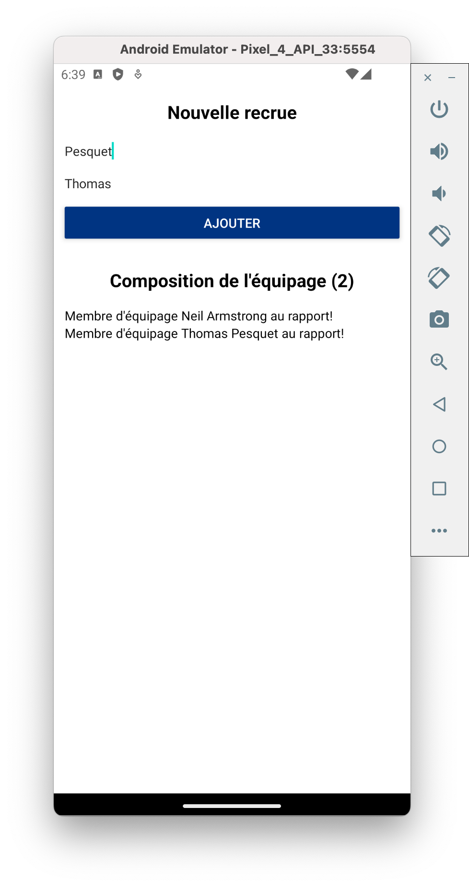
<br>

<details>
<summary>Correction</summary>

```
//Test.js

import React, { useState } from "react";
import PropTypes from "prop-types";
import {
  View,
  TextInput,
  Text,
  Button,
  StyleSheet,
  FlatList,
} from "react-native";

import Colors from "../definitions/Colors";

const CrewMember = ({ firstName, lastName }) => {
  return (
    <View>
      <Text>
        Membre d'équipage {firstName} {lastName} au rapport!
      </Text>
    </View>
  );
};

CrewMember.propTypes = {
  firstName: PropTypes.string,
  lastName: PropTypes.string,
};

const Test = () => {
  const [crews, setCrews] = useState([]);
  const [firstName, setFirstName] = useState("");
  const [lastName, setLastName] = useState("");

  const addCrewMember = () => {
    if (firstName && lastName) {
      setCrews([
        ...crews,
        { id: Date.now().toString(), firstName: firstName, lastName: lastName },
      ]);
    }
  };

  return (
    <View style={styles.container}>
      <View style={styles.subContainer}>
        <Text style={styles.title}>Nouvelle recrue</Text>
        <TextInput
          placeholder="Entrez votre nom"
          style={styles.form}
          onChangeText={(text) => setLastName(text)}
        />
        <TextInput
          placeholder="Entrez votre prénom"
          style={[styles.form, { marginBottom: 12 }]}
          onChangeText={(text) => setFirstName(text)}
        />
        <Button
          title="Ajouter"
          color={Colors.primary_blue}
          onPress={addCrewMember}
        />
      </View>
      <View style={styles.subContainer}>
        <Text style={styles.title}>
          Composition de l'équipage ({crews.length})
        </Text>
        <FlatList
          data={crews}
          keyExtractor={(item) => item.id}
          renderItem={({ item }) => (
            <CrewMember firstName={item.firstName} lastName={item.lastName} />
          )}
        />
      </View>
    </View>
  );
};

export default Test;

const styles = StyleSheet.create({
  container: {
    marginHorizontal: 12,
  },
  subContainer: {
    paddingVertical: 16,
  },
  title: {
    alignSelf: "center",
    fontSize: 20,
    fontWeight: "bold",
    marginBottom: 16,
  },
  form: {
    marginBottom: 8,
  },
});

```

</details>
<br>

### Créer la liste des films

Nous pouvons maintenant reprendre notre application de film et appliquer ce que nous avons vu (props, state et liste) dans le composant _Search_. Pour le moment nous allons utiliser un fichier local contenant les données; par la suite nous les récupèrerons d'une API. Créez le fichier _src/helpers/filmsData.js_ et récupérez le contenu.

Essayez d'afficher cette liste de films dans le composant Search. Vous devez obtenir le résultat suivant:

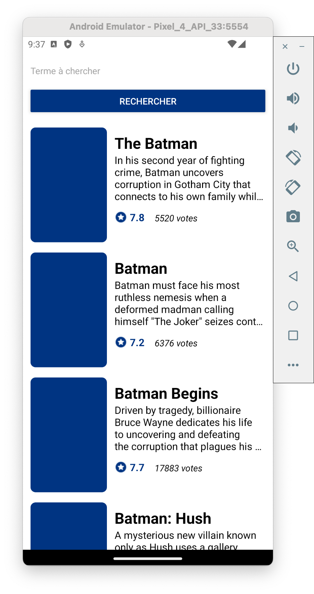

Procédez en 2 étapes:

- Mettez en place la liste pour afficher le bon nombre d'objets _FilmListItem_.
- Modifiez le composant _FilmListItem_ pour lui passer ses props afin d'afficher le contenu du fichier _filmsData_. C'est en effet _Search_ qui connait les données.

<details>
<summary>Correction</summary>

```
//Search.js

import React, { useState } from "react";
import { View, TextInput, Button, StyleSheet, FlatList } from "react-native";

import FilmListItem from "../components/FilmListItem";

import Colors from "../definitions/Colors";
import filmsData from "../helpers/filmsData";

const Search = () => {
  const [films, setFilms] = useState(filmsData.results);

  return (
    <View style={styles.container}>
      <View style={styles.searchContainer}>
        <TextInput
          placeholder="Terme à chercher"
          style={styles.inputSearchTerm}
        />
        <Button
          title="Rechercher"
          color={Colors.primary_blue}
          onPress={() => {
            console.log(films.length);
          }}
        />
      </View>
      <FlatList
        data={films}
        keyExtractor={(item) => item.id.toString()}
        renderItem={({ item }) => <FilmListItem filmData={item} />}
      />
    </View>
  );
};

export default Search;

const styles = StyleSheet.create({
  container: {
    flex: 1,
    paddingHorizontal: 12,
    marginTop: 16,
  },
  searchContainer: {
    marginBottom: 16,
  },
  inputSearchTerm: {
    marginBottom: 16,
  },
});


```

```
//FilmListItem.js

import React from "react";
import { View, StyleSheet, Image, Text } from "react-native";
import PropTypes from "prop-types";

import Assets from "../definitions/Assets";
import Colors from "../definitions/Colors";

const FilmListItem = ({
  filmData: { original_title, overview, vote_average, vote_count },
}) => (
  <View style={styles.container}>
    <Image style={styles.poster} />
    <View style={styles.informationContainer}>
      <Text style={styles.title}>{original_title}</Text>
      <Text style={styles.overview} numberOfLines={4}>
        {overview}
      </Text>
      <View style={styles.statsContainer}>
        <View style={styles.statContainer}>
          <Image style={styles.icon} source={Assets.icons.voteAverage} />
          <Text style={styles.voteAverage}>{vote_average}</Text>
        </View>
        <View style={styles.statContainer}>
          <Text style={styles.voteCount}>{vote_count}</Text>
        </View>
      </View>
    </View>
  </View>
);

FilmListItem.propTypes = {
  filmData: PropTypes.shape({
    original_title: PropTypes.string,
    overview: PropTypes.string,
    vote_average: PropTypes.number,
    vote_count: PropTypes.number,
  }).isRequired,
};

export default FilmListItem;

const styles = StyleSheet.create({
  container: {
    flexDirection: "row",
    paddingVertical: 8,
  },
  informationContainer: {
    flex: 1,
    marginLeft: 12,
    marginTop: 8,
  },
  statsContainer: {
    flexDirection: "row",
    marginTop: 12,
  },
  statContainer: {
    flexDirection: "row",
    alignItems: "center",
    marginRight: 16,
  },
  poster: {
    width: 120,
    height: 180,
    borderRadius: 8,
    backgroundColor: Colors.primary_blue,
  },
  title: {
    fontSize: 24,
    fontWeight: "bold",
  },
  voteAverage: {
    fontSize: 16,
    fontWeight: "bold",
    color: Colors.primary_blue,
  },
  voteCount: {
    fontSize: 14,
    alignSelf: "flex-end",
    fontStyle: "italic",
  },
  overview: {
    fontSize: 16,
  },
  icon: {
    tintColor: Colors.primary_blue,
    width: 20,
    height: 20,
    marginRight: 4,
  },
});


```

</details>

### Requêtes internet (fetch)

Rappel sur la forme d'une requête en utilisant fetch:

```
//Déclaration
const getMoviesFromApiAsync = async () => {
  try {
    const response = await fetch('https://reactnative.dev/movies.json');
    const json = await response.json();
    return json.movies;
  } catch (error) {
    console.error(error);
  }
};
//Utilisation
export default App = () => {
  const [data, setData] = useState([]);
  const loadData = async () => {
    const res = await getMoviesFromApiAsync();
    setData(res);
    console.log(res);
  }
  return (
    <View style={{ flex: 1, padding: 24 }}>
      <Button
        title="load"
        onPress={loadData}/>
      <FlatList
        data={data}
        keyExtractor={({ id }, index) => id}
        renderItem={({ item }) => (
          <Text>{item.title}, {item.releaseYear}</Text>) }
        />
    </View>
  );
};
```

Fetch permet de gérer de nombreux paramètres pour les requêtes (méthode, headers, etc...) en fonction des besoins.  
N'oubliez pas que:

- Fetch est asynchrone. Pensez à attendre le retour de la fonction (utilisation des mots clés _await/async_)
- Pour traiter la réponse, il est plus simple de convertir en format JSON
- Pensez à mettre le tout dans un _try/catch_ et gérez les erreurs

### Récupérer les films depuis l'API TMDB

Afin d'avoir plus de résultats et de ne plus charger uniquement les films du fichier local, nous allons utiliser l'api [The Movie Database](https://developers.themoviedb.org/3/getting-started).

A l'aide de la documentation, construisez la requête pour faire une recherche sur les films (SEARCH/MOVIE). Une bonne pratique est de centraliser les fonctions pour appeler une api dans un fichier dédié; créez le fichier _src/api/TMDB.js_ pour cela.  
Pensez à regarder comment vous authentifier auprès de l'api.

Une fois cela en place, utilisez la requête dans le composant Search.js. Après un appui sur le bouton, interrogez la base de données en prenant en compte le terme entré par l'utilisateur et affichez les résultats dans la liste. Pour l'instant, vous n'aurez que 20 résultats.  
Vous devriez obtenir un résultat similaire:

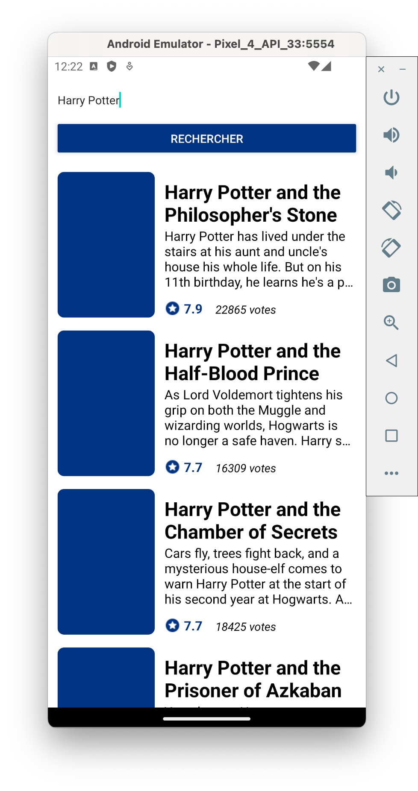
<br>

<details>
<summary>Correction</summary>

```
//TMDB.js

import { API_Bearer } from "./config";
export async function searchMovie(searchTerm = "") {
  try {
    const myHeaders = new Headers({
      Authorization: API_Bearer,
    });
    const url = `https://api.themoviedb.org/3/search/movie?query=${searchTerm}`;
    const response = await fetch(url, { headers: myHeaders });
    const json = await response.json();
    return json;
  } catch (error) {
    console.log(`Error with function TMBD/searchMovie: ${error.message}`);
    throw error;
  }
}

```

```
//Search.js

import React, { useState } from "react";
import { View, TextInput, Button, StyleSheet, FlatList } from "react-native";

import FilmListItem from "../components/FilmListItem";

import Colors from "../definitions/Colors";
import filmsData from "../helpers/filmsData";
import { searchMovie } from "../api/TMDB";

const Search = () => {
  const [films, setFilms] = useState([]);
  const [searchTerm, setSearchTerm] = useState("");

  const searchFilms = async () => {
    console.log("Search Movies");
    try {
      const TMDBSearchMovieResult = await searchMovie(searchTerm);
      setFilms(TMDBSearchMovieResult.results);
    } catch (error) {}
  };

  return (
    <View style={styles.container}>
      <View style={styles.searchContainer}>
        <TextInput
          placeholder="Terme à chercher"
          style={styles.inputSearchTerm}
          onChangeText={(text) => setSearchTerm(text)}
        />
        <Button
          title="Rechercher"
          color={Colors.primary_blue}
          onPress={searchFilms}
        />
      </View>
      <FlatList
        data={films}
        keyExtractor={(item) => item.id.toString()}
        renderItem={({ item }) => <FilmListItem filmData={item} />}
      />
    </View>
  );
};

export default Search;

const styles = StyleSheet.create({
  container: {
    flex: 1,
    paddingHorizontal: 12,
    marginTop: 16,
  },
  searchContainer: {
    marginBottom: 16,
  },
  inputSearchTerm: {
    marginBottom: 16,
  },
});

```

</details>

### Récupérer tous les résultats

L'API envoi au maximum 20 résultats à chaque requête. Il faudrait que lorsque l'utilisateur scroll sur le bas de la liste, s'il reste des résultats à charger, l'application fasse une nouvelle requête à l'API.

Première étape, regarder la documentation de l'API. Heureusement pour nous, la pagination est supportée nativement dans les réponses; vous n'aurez pas de mal à gérer cette partie.

Seconde étape, détecter lorsque l'utilisateur arrive en bas de la liste pour charger d'avantage de résultats. La documentation de FlatList nous donne les deux infos suivantes:

- **onEndReached** (function): call when the scroll position gets within onEndReachedThreshold of the rendered content
- **onEndReachedThreshold** (number): How far from the end (in units of visible length of the list) the bottom edge of the list must be from the end of the content to trigger the onEndReached callback. Thus a value of 0.5 will trigger onEndReached when the end of the content is within half the visible length of the list

Pour faire simple, la fonction définie dans la propriété _onEndReached_ sera appelée lorsque l'utilisateur sera à la fin de la liste - la taille d'écran définie dans _onEndReachedThreshold_ (en pratique, definissez cette valeur à 0.5).  
Dans le code cela donne:

```
...
_loadMoreFilms = () => {
  console.log("End of the list");
}
...
      <FlatList
        ...
        onEndReached={ _loadMoreFilms }
        onEndReachedThreshold={ 0.5 }
      />
```

N'oubliez pas de:

- Stocker la/les variable(s) de pagination
- Ne pas faire de requêtes inutiles (s'il n'y a plus de résultats à charger)
- Initialiser / réinitialiser la/les variable(s) à chaque nouvelle recherche
- Ajouter les nouveaux résultats à la liste de films existante ou effacer les précédents films

<details>
<summary>Correction</summary>

```
//TMDB.js

import { API_Bearer } from "./config";
export async function searchMovie(searchTerm = "", page = 1) {
  try {
    const myHeaders = new Headers({
      Authorization: API_Bearer,
    });
    const url = `https://api.themoviedb.org/3/search/movie?query=${searchTerm}&page=${page}`;
    const response = await fetch(url, { headers: myHeaders });
    const json = await response.json();
    return json;
  } catch (error) {
    console.log(`Error with function TMBD/searchMovie: ${error.message}`);
    throw error;
  }
}

```

```
//Search.js

import React, { useState } from "react";
import { View, TextInput, Button, StyleSheet, FlatList } from "react-native";

import FilmListItem from "../components/FilmListItem";

import Colors from "../definitions/Colors";
import { searchMovie } from "../api/TMDB";

const Search = () => {
  const [films, setFilms] = useState([]);
  const [searchTerm, setSearchTerm] = useState("");
  const [currentPage, setCurrentPage] = useState(1);
  const [isMorePages, setIsMorePages] = useState(true);

  const searchFilms = async (currentFilms, pageToRequest) => {
    console.log(
      "Search Movies; previously " +
        currentFilms.length +
        " films and will request page n° " +
        pageToRequest
    );
    try {
      const TMDBSearchMovieResult = await searchMovie(
        searchTerm,
        pageToRequest
      );
      setFilms([...currentFilms, ...TMDBSearchMovieResult.results]);
      setCurrentPage(TMDBSearchMovieResult.page);
      TMDBSearchMovieResult.page == TMDBSearchMovieResult.total_pages
        ? setIsMorePages(false)
        : setIsMorePages(true);
    } catch (error) {}
  };

  const newSearchFilms = () => {
    searchFilms([], 1);
  };

  const loadMoreFilms = () => {
    if (isMorePages) {
      searchFilms(films, currentPage + 1);
    }
  };

  return (
    <View style={styles.container}>
      <View style={styles.searchContainer}>
        <TextInput
          placeholder="Terme à chercher"
          style={styles.inputSearchTerm}
          onChangeText={(text) => setSearchTerm(text)}
        />
        <Button
          title="Rechercher"
          color={Colors.primary_blue}
          onPress={newSearchFilms}
        />
      </View>
      <FlatList
        data={films}
        keyExtractor={(item) => item.id.toString()}
        renderItem={({ item }) => <FilmListItem filmData={item} />}
        onEndReached={loadMoreFilms}
        onEndReachedThreshold={0.5}
      />
    </View>
  );
};

export default Search;

const styles = StyleSheet.create({
  container: {
    flex: 1,
    paddingHorizontal: 12,
    marginTop: 16,
  },
  searchContainer: {
    marginBottom: 16,
  },
  inputSearchTerm: {
    marginBottom: 16,
  },
});

```

</details>

### Ajout de quelques fonctionnalités

#### Icône de chargement + pull to resfresh

Le retour du call à l'API n'est pas instantané. Pendant ces quelques secondes, il ne se passe rien à l'écran: ce n'est pas une bonne expérience utilisateur. Il faut que la liste indique qu'elle attend de nouveaux résultats. Vous pouvez également ajouter une fonctionnalité de _pull to resfresh_.  
La documentation de FlatList devrait vous aider.

Commportement attendu:

- Lors d'une requête à l'API, la liste affiche une icone de chargement
- Si l'utilisateur utilise le _pull to refresh_, une nouvelle requête est émise, avec le même comportement que si l'utilisateur avait appuyé sur le bouton de recherche

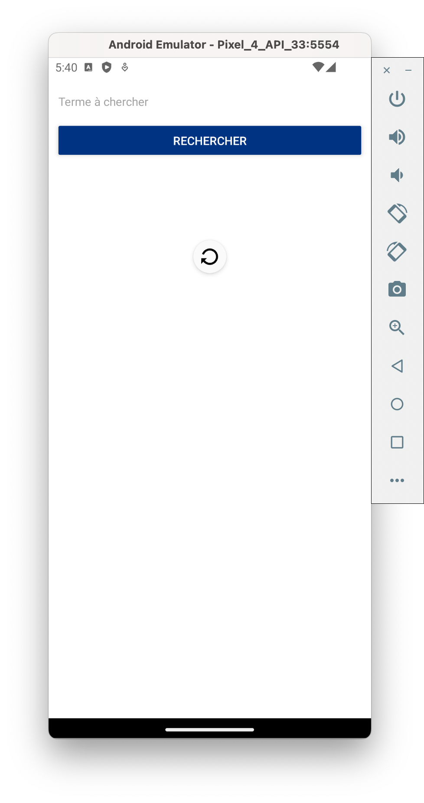

#### Affichage en cas d'erreur lors du call API

Actuellement nous ne traitons pas les erreurs lors du call API. Le comportement attendu est le suivant:

- Si pas d'erreur, comportement actuel
- Si une erreur lors du call:
  - remise à 0 des données
  - la liste est remplacée par un autre composant affichant un message d'erreur

Faite bien un composant séparé pour afficher l'erreur (_src/components/DisplayError.js_), pour qu'il puisse être réutilisé par la suite. Le mieux est même que ce composant prenne en props le message d'erreur à afficher. Pour tester le comportement, vous pouvez toujours retourner une erreur dans la fonction qui effectue la requête API.

La seule chose que vous ne savez pour l'instant pas faire est l'affichage conditionnel dans le JSX. Voici un exemple:

```
{ isError ? (
    // Afficher le composant erreur ici
  ) : (
    <FlatList
      ...
    />
)}
```

Résultat attendu :

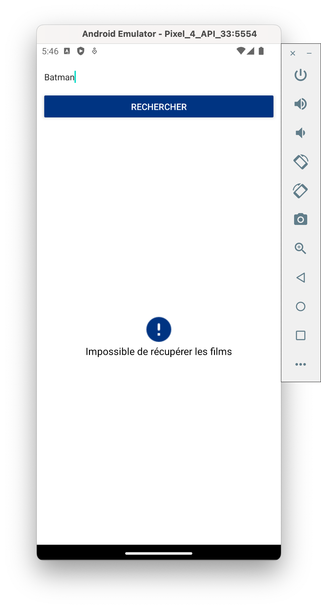

#### Améliorer le clavier

2 fonctionnalités à ajouter sur le clavier:

- Lancer la recherche avec le bouton "OK"
- Fermer le clavier lorsqu'une recherche est lancée

#### Afficher l'image du film

Chaque film renvoyé par TMDB contient un chemin pour récupérer le poster:

```
...
"popularity": 228.777,
"poster_path": "/or06FN3Dka5tukK1e9sl16pB3iy.jpg",
"release_date": "2019-04-24",
...
```

A l'aide la documentation de l'API (pour récupérer le chemin complet) et de la documentation du composant _Image_, vous devriez pouvoir afficher le poster dans la liste de films.

Petite particularité: il est possible de ne pas avoir de poster. Il faut gérer ce cas:

- Si un poster existe, l'afficher
- Sinon, afficher une icone pour le remplacer

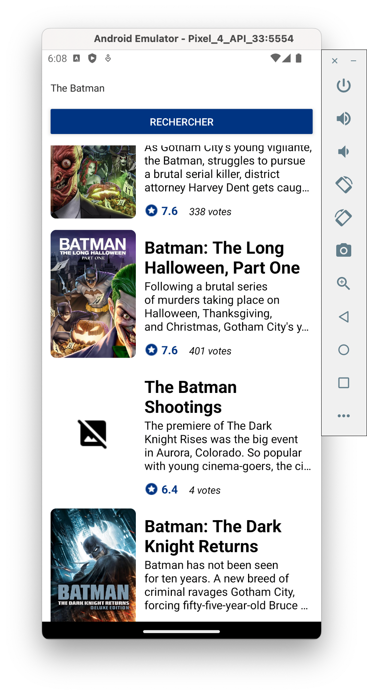
<br/>

<details>
<summary>Correction de tous les exercices</summary>

```
//Search.js

import React, { useState } from "react";
import {
  View,
  TextInput,
  Button,
  StyleSheet,
  FlatList,
  Keyboard,
} from "react-native";

import FilmListItem from "../components/FilmListItem";
import DisplayError from "./DisplayError";

import Colors from "../definitions/Colors";
import { searchMovie } from "../api/TMDB";

const Search = () => {
  const [films, setFilms] = useState([]);
  const [searchTerm, setSearchTerm] = useState("");
  const [currentPage, setCurrentPage] = useState(1);
  const [isMorePages, setIsMorePages] = useState(true);
  const [isRefreshing, setIsRefreshing] = useState(false);
  const [isError, setIsError] = useState(false);

  const searchFilms = async (currentFilms, pageToRequest) => {
    setIsRefreshing(true);
    setIsError(false);
    console.log(
      "Search Movies; previously " +
        currentFilms.length +
        " films and will request page n° " +
        pageToRequest
    );
    try {
      const TMDBSearchMovieResult = await searchMovie(
        searchTerm,
        pageToRequest
      );
      setFilms([...currentFilms, ...TMDBSearchMovieResult.results]);
      setCurrentPage(TMDBSearchMovieResult.page);
      TMDBSearchMovieResult.page == TMDBSearchMovieResult.total_pages
        ? setIsMorePages(false)
        : setIsMorePages(true);
    } catch (error) {
      setIsError(true);
      setFilms([]);
      setIsMorePages(true);
      setCurrentPage(1);
    }
    setIsRefreshing(false);
  };

  const newSearchFilms = () => {
    Keyboard.dismiss();
    searchFilms([], 1);
  };

  const loadMoreFilms = () => {
    if (isMorePages) {
      searchFilms(films, currentPage + 1);
    }
  };

  return (
    <View style={styles.container}>
      <View style={styles.searchContainer}>
        <TextInput
          placeholder="Terme à chercher"
          style={styles.inputSearchTerm}
          onChangeText={(text) => setSearchTerm(text)}
          onSubmitEditing={newSearchFilms}
        />
        <Button
          title="Rechercher"
          color={Colors.primary_blue}
          onPress={newSearchFilms}
        />
      </View>
      {isError ? (
        <DisplayError message="Impossible de récupérer les films" />
      ) : (
        <FlatList
          data={films}
          keyExtractor={(item) => item.id.toString()}
          renderItem={({ item }) => <FilmListItem filmData={item} />}
          onEndReached={loadMoreFilms}
          onEndReachedThreshold={0.5}
          refreshing={isRefreshing}
          onRefresh={newSearchFilms}
        />
      )}
    </View>
  );
};

export default Search;

const styles = StyleSheet.create({
  container: {
    flex: 1,
    paddingHorizontal: 12,
    marginTop: 16,
  },
  searchContainer: {
    marginBottom: 16,
  },
  inputSearchTerm: {
    marginBottom: 16,
  },
});

```

```
//Asset.js

import icon_voteAverage from "../../assets/voteAverage.png";
import icon_error from "../../assets/error.png";
import icon_missingIMG from "../../assets/missingImage.png";

const Assets = {
  icons: {
    voteAverage: icon_voteAverage,
    error: icon_error,
    missingIMG: icon_missingIMG,
  },
};

export default Assets;

```

```
//FilmListItem.js

import React from "react";
import { View, StyleSheet, Image, Text } from "react-native";
import PropTypes from "prop-types";

import Assets from "../definitions/Assets";
import Colors from "../definitions/Colors";

const FilmListItem = ({
  filmData: { original_title, overview, vote_average, vote_count, poster_path },
}) => {
  const getPoster = () => {
    if (poster_path) {
      return (
        <Image
          style={styles.poster}
          source={{ uri: `https://image.tmdb.org/t/p/w500/${poster_path}` }}
        />
      );
    }
    return (
      <View style={styles.noPoster}>
        <Image source={Assets.icons.missingIMG} />
      </View>
    );
  };

  return (
    <View style={styles.container}>
      {getPoster()}
      <View style={styles.informationContainer}>
        <Text style={styles.title}>{original_title}</Text>
        <Text style={styles.overview} numberOfLines={4}>
          {overview}
        </Text>
        <View style={styles.statsContainer}>
          <View style={styles.statContainer}>
            <Image style={styles.icon} source={Assets.icons.voteAverage} />
            <Text style={styles.voteAverage}>{vote_average}</Text>
          </View>
          <View style={styles.statContainer}>
            <Text style={styles.voteCount}>{vote_count} votes</Text>
          </View>
        </View>
      </View>
    </View>
  );
};

FilmListItem.propTypes = {
  filmData: PropTypes.shape({
    original_title: PropTypes.string,
    overview: PropTypes.string,
    vote_average: PropTypes.number,
    vote_count: PropTypes.number,
    poster_path: PropTypes.string,
  }).isRequired,
};

export default FilmListItem;

const styles = StyleSheet.create({
  container: {
    flexDirection: "row",
    paddingVertical: 8,
  },
  informationContainer: {
    flex: 1,
    marginLeft: 12,
    marginTop: 8,
  },
  statsContainer: {
    flexDirection: "row",
    marginTop: 12,
  },
  statContainer: {
    flexDirection: "row",
    alignItems: "center",
    marginRight: 16,
  },
  poster: {
    width: 120,
    height: 180,
    borderRadius: 8,
    backgroundColor: Colors.primary_blue,
  },
  noPoster: {
    width: 120,
    height: 180,
    alignItems: "center",
    justifyContent: "center",
  },
  title: {
    fontSize: 24,
    fontWeight: "bold",
  },
  voteAverage: {
    fontSize: 16,
    fontWeight: "bold",
    color: Colors.primary_blue,
  },
  voteCount: {
    fontSize: 14,
    alignSelf: "flex-end",
    fontStyle: "italic",
  },
  overview: {
    fontSize: 16,
  },
  icon: {
    tintColor: Colors.primary_blue,
    width: 20,
    height: 20,
    marginRight: 4,
  },
});

```

```
//DisplayError.js
import React from "react";
import { View, StyleSheet, Text, Image } from "react-native";

import Assets from "../definitions/Assets";
import Colors from "../definitions/Colors";

const DisplayError = ({ message = "Une erreur c'est produite" }) => (
  <View style={styles.container}>
    <Image source={Assets.icons.error} style={styles.icon} />
    <Text style={styles.errorText}>{message}</Text>
  </View>
);

export default DisplayError;

const styles = StyleSheet.create({
  container: {
    flex: 1,
    alignItems: "center",
    justifyContent: "center",
  },
  icon: {
    tintColor: Colors.primary_blue,
  },
  errorText: {
    fontSize: 16,
  },
});

```

</details>

## Détails d'un film

### React navigation

Installation:

```
npm install @react-navigation/native
expo install react-native-gesture-handler react-native-reanimated react-native-screens react-native-safe-area-context @react-native-community/masked-view
npm install @react-navigation/stack
```

StackNavigator:

```
//Création
const StackNavigator = createStackNavigator();
function RootStack() {
  return (
    <StackNavigator.Navigator
      initialRouteName="ScreenName1" >
      <StackNavigator.Screen
        name="ScreenName1"
        component={Screen} />
      ...
    </StackNavigator.Navigator>
  );
}
export default RootStack;
//Utilisation
export default function App() {
  return (
    <NavigationContainer>
      <RootStack /> //composant importé
      ...
    </NavigationContainer>
  );
}
```

Navigation:

```
//Pour naviguer vers un autre écran, utilisez la props 'navigate'
navigation.navigate('screenName', {
  paramName: paramValue,
  ...
});
//Pour récupérer les paramètres, utilisez la props 'route'
const { paramName } = route.params;
```

### Naviguer de l'aperçu à la page du film

Vous allez pouvoir mettre en place la première navigation de votre application. Lorsque l'utilisateur clique sur un élément de la liste, il doit ouvrir une nouvelle page (qui contiendra les détails du film). Pour vous aider, voici les étapes:

- Créez un nouveau composant _Film.js_
- Modifiez le composant _FilmListItem.js_ pour détecter un clique utilisateur (voir plus bas)
- Mettez en place la structure de React Navigation
- Reliez le tout pour avoir le comportement attendu

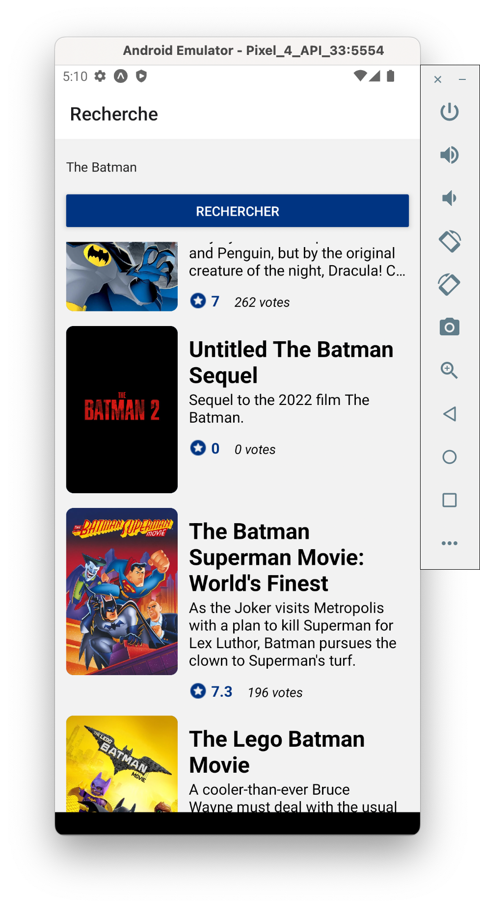
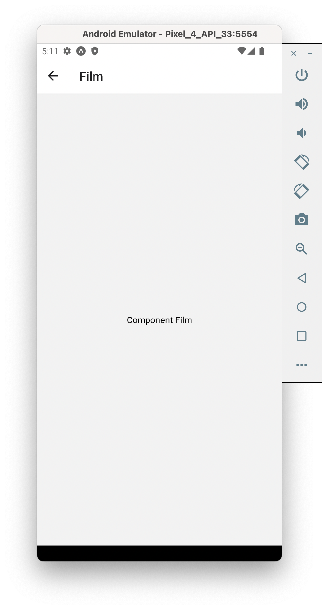

La détection du clique sur un item d'une FlatList n'est pas natif. Voici comment réaliser cette partie:

- Modifiez le composant _View_ par le composant _ToucheableOpacity_ dans _RestaurantListItem_
- Passez depuis la liste du composant _Search_ la fonction permettant la navigation vers la page d'un film
- Lorsque l'utilisateur clic sur la _ToucheableOpacity_, éxécutez la fonction pour naviguer

<details>
<summary>Correction</summary>

```
//Film.js

import React from "react";
import { View, StyleSheet, Text } from "react-native";

const Film = () => {
  return (
    <View style={styles.container}>
      <Text>Component Film</Text>
    </View>
  );
};

export default Film;

const styles = StyleSheet.create({
  container: {
    flex: 1,
    alignItems: "center",
    justifyContent: "center",
  },
});

```

```
//FilmListItem.js

import React from "react";
import { View, StyleSheet, Image, Text, TouchableOpacity } from "react-native";
import PropTypes from "prop-types";

import Assets from "../definitions/Assets";
import Colors from "../definitions/Colors";

const FilmListItem = ({
  filmData: { original_title, overview, vote_average, vote_count, poster_path },
  onClick,
}) => {
  const getPoster = () => {
    if (poster_path) {
      return (
        <Image
          style={styles.poster}
          source={{ uri: `https://image.tmdb.org/t/p/w500/${poster_path}` }}
        />
      );
    }
    return (
      <View style={styles.noPoster}>
        <Image source={Assets.icons.missingIMG} />
      </View>
    );
  };

  return (
    <TouchableOpacity style={styles.container} onPress={onClick}>
      {getPoster()}
      <View style={styles.informationContainer}>
        <Text style={styles.title}>{original_title}</Text>
        <Text style={styles.overview} numberOfLines={4}>
          {overview}
        </Text>
        <View style={styles.statsContainer}>
          <View style={styles.statContainer}>
            <Image style={styles.icon} source={Assets.icons.voteAverage} />
            <Text style={styles.voteAverage}>{vote_average}</Text>
          </View>
          <View style={styles.statContainer}>
            <Text style={styles.voteCount}>{vote_count} votes</Text>
          </View>
        </View>
      </View>
    </TouchableOpacity>
  );
};

FilmListItem.propTypes = {
  filmData: PropTypes.shape({
    original_title: PropTypes.string,
    overview: PropTypes.string,
    vote_average: PropTypes.number,
    vote_count: PropTypes.number,
    poster_path: PropTypes.string,
  }).isRequired,
  onClick: PropTypes.func.isRequired,
};

export default FilmListItem;

const styles = StyleSheet.create({
  container: {
    flexDirection: "row",
    paddingVertical: 8,
  },
  informationContainer: {
    flex: 1,
    marginLeft: 12,
    marginTop: 8,
  },
  statsContainer: {
    flexDirection: "row",
    marginTop: 12,
  },
  statContainer: {
    flexDirection: "row",
    alignItems: "center",
    marginRight: 16,
  },
  poster: {
    width: 120,
    height: 180,
    borderRadius: 8,
    backgroundColor: Colors.primary_blue,
  },
  noPoster: {
    width: 120,
    height: 180,
    alignItems: "center",
    justifyContent: "center",
  },
  title: {
    fontSize: 24,
    fontWeight: "bold",
  },
  voteAverage: {
    fontSize: 16,
    fontWeight: "bold",
    color: Colors.primary_blue,
  },
  voteCount: {
    fontSize: 14,
    alignSelf: "flex-end",
    fontStyle: "italic",
  },
  overview: {
    fontSize: 16,
  },
  icon: {
    tintColor: Colors.primary_blue,
    width: 20,
    height: 20,
    marginRight: 4,
  },
});

```

```
//Search.js

import React, { useState } from "react";
import {
  View,
  TextInput,
  Button,
  StyleSheet,
  FlatList,
  Keyboard,
} from "react-native";

import FilmListItem from "../components/FilmListItem";
import DisplayError from "./DisplayError";

import Colors from "../definitions/Colors";
import { searchMovie } from "../api/TMDB";

const Search = ({ navigation }) => {
  const [films, setFilms] = useState([]);
  const [searchTerm, setSearchTerm] = useState("");
  const [currentPage, setCurrentPage] = useState(1);
  const [isMorePages, setIsMorePages] = useState(true);
  const [isRefreshing, setIsRefreshing] = useState(false);
  const [isError, setIsError] = useState(false);

  const searchFilms = async (currentFilms, pageToRequest) => {
    setIsRefreshing(true);
    setIsError(false);
    console.log(
      "Search Movies; previously " +
        currentFilms.length +
        " films and will request page n° " +
        pageToRequest
    );
    try {
      const TMDBSearchMovieResult = await searchMovie(
        searchTerm,
        pageToRequest
      );
      setFilms([...currentFilms, ...TMDBSearchMovieResult.results]);
      setCurrentPage(TMDBSearchMovieResult.page);
      TMDBSearchMovieResult.page == TMDBSearchMovieResult.total_pages
        ? setIsMorePages(false)
        : setIsMorePages(true);
    } catch (error) {
      setIsError(true);
      setFilms([]);
      setIsMorePages(true);
      setCurrentPage(1);
    }
    setIsRefreshing(false);
  };

  const newSearchFilms = () => {
    Keyboard.dismiss();
    searchFilms([], 1);
  };

  const loadMoreFilms = () => {
    if (isMorePages) {
      searchFilms(films, currentPage + 1);
    }
  };

  const navigateFilmDetails = () => {
    navigation.navigate("ViewFilm");
  };

  return (
    <View style={styles.container}>
      <View style={styles.searchContainer}>
        <TextInput
          placeholder="Terme à chercher"
          style={styles.inputSearchTerm}
          onChangeText={(text) => setSearchTerm(text)}
          onSubmitEditing={newSearchFilms}
        />
        <Button
          title="Rechercher"
          color={Colors.primary_blue}
          onPress={newSearchFilms}
        />
      </View>
      {isError ? (
        <DisplayError message="Impossible de récupérer les films" />
      ) : (
        <FlatList
          data={films}
          keyExtractor={(item) => item.id.toString()}
          renderItem={({ item }) => (
            <FilmListItem filmData={item} onClick={navigateFilmDetails} />
          )}
          onEndReached={loadMoreFilms}
          onEndReachedThreshold={0.5}
          refreshing={isRefreshing}
          onRefresh={newSearchFilms}
        />
      )}
    </View>
  );
};

export default Search;

const styles = StyleSheet.create({
  container: {
    flex: 1,
    paddingHorizontal: 12,
    marginTop: 16,
  },
  searchContainer: {
    marginBottom: 16,
  },
  inputSearchTerm: {
    marginBottom: 16,
  },
});

```

```
//Navigation.js

import React from "react";
import { createStackNavigator } from "@react-navigation/stack";

import Search from "../components/Search";
import Film from "../components/Film";

const SearchNavigation = createStackNavigator();

function RootStack() {
  return (
    <SearchNavigation.Navigator initialRouteName="ViewSearch">
      <SearchNavigation.Screen
        name="ViewSearch"
        component={Search}
        options={{ title: "Recherche" }}
      />
      <SearchNavigation.Screen
        name="ViewFilm"
        component={Film}
        options={{ title: "Film" }}
      />
    </SearchNavigation.Navigator>
  );
}

export default RootStack;

```

```
//App.js

import { StatusBar } from "expo-status-bar";
import { StyleSheet, View } from "react-native";
import { NavigationContainer } from "@react-navigation/native";

import Navigation from "./src/navigation/Navigation";

export default function App() {
  return (
    <NavigationContainer>
      <Navigation />
      <StatusBar style="auto" />
    </NavigationContainer>
  );
}

const styles = StyleSheet.create({
  container: {
    flex: 1,
    backgroundColor: "#fff",
  },
});

```

</details>

### Effets de bord et cycle de vie (hook d'effets)

Les effets de bord sont des évènements communs dans la vie d'un composant; par exemple charger des données depuis internet afin de les afficher, "s'abonner" à un service pour être notifié d'un changement de valeur, etc... Il existe 2 types d'effets de bord:

- Sans nettoyage. Par exemple au chargement du composant, ce dernier doit faire une requête pour récupérer des données à afficher
- Avec nettoyage. Par exemple au chargement du composant, ce dernier doit s'abonner à un service pour être prévenu d'un futur changement, et lorsque le composant se détruit il doit se désabonner du service

Avec les Hooks de React, les effets de bord sont gérés via la fonction _useEffect_.

Exemple sans nettoyage. A chaque fois que le composant va s'afficher (donc à _l'initialisation (montage)_ ainsi qu'à chaque _refresh_) le code sera exécuté:

```
useEffect(() => {
  // Met à jour le titre du document via l’API du navigateur
  document.title = `Vous avez cliqué ${count} fois`;
});
```

Exemple avec nettoyage. A chaque fois que le composant va s'afficher (donc à _l'initialisation (montage)_ ainsi qu'à chaque _refresh_) le code sera exécuté. De plus, au moment ou le composant va se _détruire (démonter)_ la fonction du return sera exécutée:

```
useEffect(() => {
  // Code classique du useEffect
  function handleStatusChange(status) {
    setIsOnline(status.isOnline);
  }
  ChatAPI.subscribeToFriendStatus(props.friend.id, handleStatusChange);
  // Indique comment nettoyer l'effet :
  return function cleanup() { // Le nom de la fonction n'a pas d'importance
    ChatAPI.unsubscribeFromFriendStatus(props.friend.id, handleStatusChange);
  };
});
```

_useEffect_ est appelée à chaque fois que le composant se met à jour. Un comportement standard est de vouloir exécuter la fonction que lorsqu'une ou plusieurs données changent:

```
useEffect(() => {
  document.title = `Vous avez cliqué ${count} fois`;
}, [count]); // N’exécute l’effet que si count a changé
```

Un autre cas commun est de vouloir exécuter _useEffect_ uniquement à l'initialisation du composant:

```
useEffect(() => {
  document.title = loadData();
}, []); // N’exécute que lors de l'initialisation
```

### Récupérer les données du film

Le but de la nouvelle page est d'afficher les informations d'un film, en chargeant les données depuis l'API (pour l'instant uniquement le nom). Voici le comportement à mettre en place ainsi que des indications:

- Ajoutez une fonction dans _film.js_ prennant en paramètre l'id d'un film pour récupérer les données (regardez la doc pour voir l'endpoint à utiliser)
- Passez l'id du film en paramètre de la navigation à la page des détails du film
- Mettez en place le chargement de la page du film:
  - Affichez un loader à l'initialisation de la page (composant _ActivityIndicator_)
  - Un fois le composant React initialisé, faite un call API pour récupérer les données du film (via _UseEffect_)
  - Une fois les données du film récupérées, arrétez d'afficher le loader et affichez le nom du film (ou le composant d'erreur si échec du call)

_Pourquoi ne pas mettre le call API dans le \_useState_?\_  
Le retour de l'API est incertain; nous ne savons pas quand il va revenir ni même s'il va revenir. De plus il faut être certain que le composant a fini de s'initialiser avant de vouloir le modifier.

Résultat attendu:

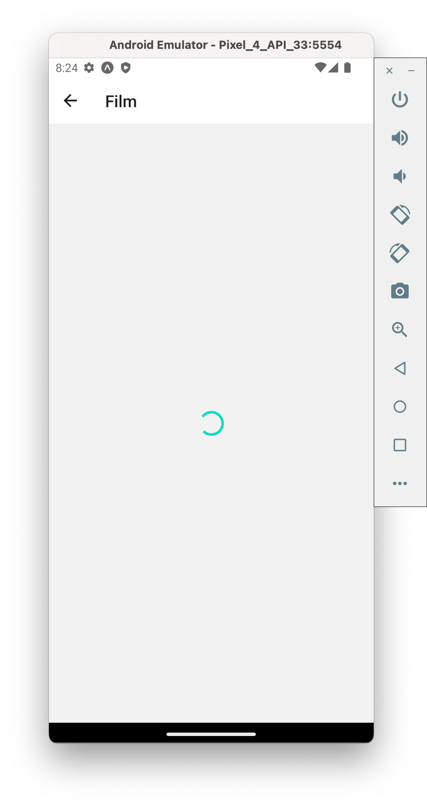
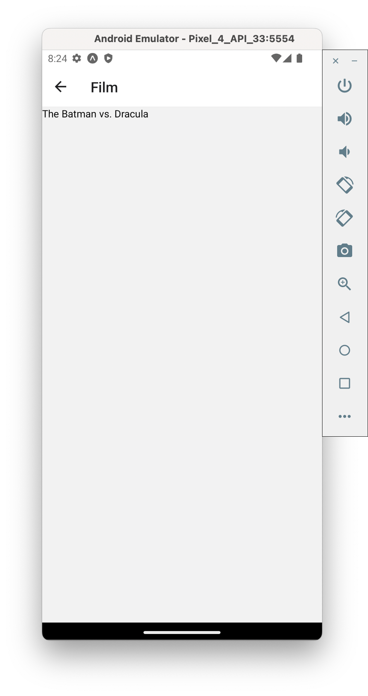
<br/>

<details>
<summary>Correction</summary>

```
//TMDB.js

import { API_Bearer } from "./config";

export async function searchMovie(searchTerm = "", page = 1) {
  try {
    const myHeaders = new Headers({
      Authorization: API_Bearer,
    });
    const url = `https://api.themoviedb.org/3/search/movie?query=${searchTerm}&page=${page}`;
    const response = await fetch(url, { headers: myHeaders });
    const json = await response.json();
    return json;
  } catch (error) {
    console.log(`Error with function TMBD/searchMovie: ${error.message}`);
    throw error;
  }
}

export async function detailsMovie(movieID) {
  try {
    const myHeaders = new Headers({
      Authorization: API_Bearer,
    });
    const url = `https://api.themoviedb.org/3/movie/${movieID}`;
    const response = await fetch(url, { headers: myHeaders });
    const json = await response.json();
    return json;
  } catch (error) {
    console.log(`Error with function TMBD/detailsMovie: ${error.message}`);
    throw error;
  }
}

```

```
//Film.js

import React, { useState, useEffect } from "react";
import { View, StyleSheet, Text, ActivityIndicator } from "react-native";

import DisplayError from "../components/DisplayError";

import { detailsMovie } from "../api/TMDB";

const Film = ({ route }) => {
  const [isLoading, setIsLoading] = useState(true);
  const [film, setFilm] = useState(null);
  const [isError, setIsError] = useState(false);

  useEffect(() => {
    requestFilm();
  }, []); //Uniquement à l'initialisation

  //Pourrait être directement déclarée dans useEffect
  const requestFilm = async () => {
    try {
      const TMDBDetailsMovieResult = await detailsMovie(route.params.filmID);
      setFilm(TMDBDetailsMovieResult);
      setIsLoading(false);
    } catch (error) {
      setIsError(true);
    }
  };

  return (
    <View style={styles.container}>
      {isError ? (
        <DisplayError message="Impossible de récupérer les données du film" />
      ) : isLoading ? (
        <View style={styles.containerLoading}>
          <ActivityIndicator size="large" />
        </View>
      ) : (
        <Text>{film.original_title}</Text>
      )}
    </View>
  );
};

export default Film;

const styles = StyleSheet.create({
  container: {
    flex: 1,
  },
  containerLoading: {
    flex: 1,
    justifyContent: "center",
    alignItems: "center",
  },
});

```

```
//Search.js

import React, { useState } from "react";
import {
  View,
  TextInput,
  Button,
  StyleSheet,
  FlatList,
  Keyboard,
} from "react-native";

import FilmListItem from "../components/FilmListItem";
import DisplayError from "./DisplayError";

import Colors from "../definitions/Colors";
import { searchMovie } from "../api/TMDB";

const Search = ({ navigation }) => {
  const [films, setFilms] = useState([]);
  const [searchTerm, setSearchTerm] = useState("");
  const [currentPage, setCurrentPage] = useState(1);
  const [isMorePages, setIsMorePages] = useState(true);
  const [isRefreshing, setIsRefreshing] = useState(false);
  const [isError, setIsError] = useState(false);

  const searchFilms = async (currentFilms, pageToRequest) => {
    setIsRefreshing(true);
    setIsError(false);
    console.log(
      "Search Movies; previously " +
        currentFilms.length +
        " films and will request page n° " +
        pageToRequest
    );
    try {
      const TMDBSearchMovieResult = await searchMovie(
        searchTerm,
        pageToRequest
      );
      setFilms([...currentFilms, ...TMDBSearchMovieResult.results]);
      setCurrentPage(TMDBSearchMovieResult.page);
      TMDBSearchMovieResult.page == TMDBSearchMovieResult.total_pages
        ? setIsMorePages(false)
        : setIsMorePages(true);
    } catch (error) {
      setIsError(true);
      setFilms([]);
      setIsMorePages(true);
      setCurrentPage(1);
    }
    setIsRefreshing(false);
  };

  const newSearchFilms = () => {
    Keyboard.dismiss();
    searchFilms([], 1);
  };

  const loadMoreFilms = () => {
    if (isMorePages) {
      searchFilms(films, currentPage + 1);
    }
  };

  const navigateFilmDetails = (filmID) => {
    navigation.navigate("ViewFilm", { filmID });
  };

  return (
    <View style={styles.container}>
      <View style={styles.searchContainer}>
        <TextInput
          placeholder="Terme à chercher"
          style={styles.inputSearchTerm}
          onChangeText={(text) => setSearchTerm(text)}
          onSubmitEditing={newSearchFilms}
        />
        <Button
          title="Rechercher"
          color={Colors.primary_blue}
          onPress={newSearchFilms}
        />
      </View>
      {isError ? (
        <DisplayError message="Impossible de récupérer les films" />
      ) : (
        <FlatList
          data={films}
          keyExtractor={(item) => item.id.toString()}
          renderItem={({ item }) => (
            <FilmListItem
              filmData={item}
              onClick={() => {
                navigateFilmDetails(item.id);
              }}
            />
          )}
          onEndReached={loadMoreFilms}
          onEndReachedThreshold={0.5}
          refreshing={isRefreshing}
          onRefresh={newSearchFilms}
        />
      )}
    </View>
  );
};

export default Search;

const styles = StyleSheet.create({
  container: {
    flex: 1,
    paddingHorizontal: 12,
    marginTop: 16,
  },
  searchContainer: {
    marginBottom: 16,
  },
  inputSearchTerm: {
    marginBottom: 16,
  },
});

```

</details>

### Réalisation de l'interface

Maintenant que la logique de navigation / récupération des données de la page du film est en place, il ne reste plus qu'à réaliser l'interface. Comme souvent, cette étape n'est pas la plus compliquée mais prend du temps: c'est un bon exercice pour appliquer ce que vous avez appris. Petites difficultés:

- Comment afficher les sociétés de production ? Pas besoin d'utiliser un composant FlatList
- Comment faire si le contenu ne tient pas sur un écran en hauteur ?

Résultat attendu:

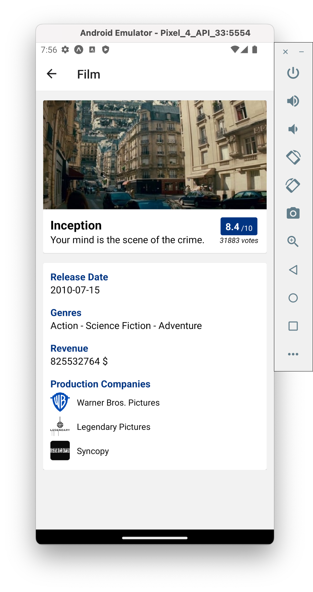
<br/>

<details>
<summary>Correction</summary>

```
//ProductionCompanyItem.js

import React from "react";
import { View, StyleSheet, Text, Image } from "react-native";
import PropTypes from "prop-types";

import Assets from "../definitions/Assets";

const ProductionCompanyItem = ({ companyData: { logo_path, name } }) => {
  const getCompanyLogo = () => {
    if (logo_path) {
      return (
        <Image
          style={styles.companyLogo}
          source={{ uri: `https://image.tmdb.org/t/p/w500/${logo_path}` }}
        />
      );
    }
    return (
      <Image style={styles.companyLogo} source={Assets.icons.missingIMG} />
    );
  };

  return (
    <View style={styles.container}>
      {getCompanyLogo()}
      <Text style={styles.textContent}> {name}</Text>
    </View>
  );
};

ProductionCompanyItem.propTypes = {
  companyData: PropTypes.shape({
    logo_path: PropTypes.string,
    name: PropTypes.string,
  }).isRequired,
};

export default ProductionCompanyItem;

const styles = StyleSheet.create({
  container: {
    flexDirection: "row",
    paddingVertical: 4,
    alignItems: "center",
  },
  companyLogo: {
    width: 32,
    height: 32,
    resizeMode: "contain",
    borderRadius: 4,
    marginRight: 8,
  },
  textContent: {
    fontSize: 14,
  },
});

```

```
//Film.js

import React, { useState, useEffect } from "react";
import {
  View,
  StyleSheet,
  Text,
  ActivityIndicator,
  ScrollView,
  Image,
} from "react-native";

import DisplayError from "../components/DisplayError";
import ProductionCompanyItem from "../components/ProductionCompanyItem";

import { detailsMovie } from "../api/TMDB";

import Colors from "../definitions/Colors";
import Assets from "../definitions/Assets";

const Film = ({ route }) => {
  const [isLoading, setIsLoading] = useState(true);
  const [film, setFilm] = useState(null);
  const [isError, setIsError] = useState(false);

  useEffect(() => {
    requestFilm();
  }, []); //Uniquement à l'initialisation

  //Pourrait être directement déclarée dans useEffect
  const requestFilm = async () => {
    try {
      const TMDBDetailsMovieResult = await detailsMovie(route.params.filmID);
      setFilm(TMDBDetailsMovieResult);
      setIsLoading(false);
    } catch (error) {
      setIsError(true);
    }
  };

  const displayFilmBackdrop = () => {
    if (film.backdrop_path) {
      return (
        <Image
          style={styles.filmBackdrop}
          source={{
            uri: `https://image.tmdb.org/t/p/w500/${film.backdrop_path}`,
          }}
        />
      );
    }
    return (
      <View style={styles.containerNoFilmBackdrop}>
        <Image source={Assets.icons.missingIMG} />
      </View>
    );
  };

  const displayProductionCompanies = () => {
    let companiesJSX = [];
    film.production_companies.forEach((company, index) => {
      companiesJSX.push(
        <ProductionCompanyItem key={index} companyData={company} />
      );
    });
    return <View>{companiesJSX}</View>;
  };

  const getGenres = () => {
    let genres = "";
    if (film.genres) {
      film.genres.forEach((genre) => {
        genres += genre.name + " - ";
      });
      genres = genres.slice(0, -3);
    }
    return genres;
  };

  return (
    <View style={styles.container}>
      {isError ? (
        <DisplayError message="Impossible de récupérer les données du film" />
      ) : isLoading ? (
        <View style={styles.containerLoading}>
          <ActivityIndicator size="large" />
        </View>
      ) : (
        <ScrollView style={styles.containerScroll}>
          {displayFilmBackdrop()}
          <View style={styles.containerCardTop}>
            <View style={styles.containerHeaderMovie}>
              <Text style={styles.textOriginalTitle}>
                {film.original_title}
              </Text>
              <Text style={styles.textContent}>{film.tagline}</Text>
            </View>
            <View style={styles.containerVotes}>
              <View style={styles.containerVoteAverage}>
                <Text style={styles.textVoteAverage}>{film.vote_average}</Text>
                <Text style={styles.textMaxVote}>/10</Text>
              </View>
              <Text style={styles.textVotesCount}>{film.vote_count} votes</Text>
            </View>
          </View>
          <View style={styles.containerCardBottom}>
            <Text style={[styles.textInfoName, { marginTop: 0 }]}>
              Release Date
            </Text>
            <Text style={styles.textContent}>{film.release_date}</Text>
            <Text style={styles.textInfoName}>Genres</Text>
            <Text style={styles.textContent}>{getGenres()}</Text>
            <Text style={styles.textInfoName}>Revenue</Text>
            <Text style={styles.textContent}>{film.revenue + " $"}</Text>
            <Text style={styles.textInfoName}>Production Companies</Text>
            {displayProductionCompanies()}
          </View>
        </ScrollView>
      )}
    </View>
  );
};

export default Film;

const styles = StyleSheet.create({
  container: {
    flex: 1,
  },
  containerLoading: {
    flex: 1,
    justifyContent: "center",
    alignItems: "center",
  },
  containerScroll: {
    flex: 1,
    paddingHorizontal: 12,
    paddingVertical: 16,
  },
  containerCardTop: {
    elevation: 1,
    borderRadius: 3,
    padding: 12,
    flexDirection: "row",
    backgroundColor: "white",
  },
  containerCardBottom: {
    elevation: 1,
    marginTop: 16,
    borderRadius: 3,
    padding: 12,
    backgroundColor: "white",
  },
  containerHeaderMovie: {
    flex: 4,
    marginRight: 8,
  },
  containerVotes: {
    flex: 1,
    alignItems: "center",
    justifyContent: "center",
  },
  containerVoteAverage: {
    paddingHorizontal: 8,
    paddingVertical: 4,
    backgroundColor: Colors.primary_blue,
    borderRadius: 3,
    flexDirection: "row",
    alignItems: "flex-end",
  },
  containerNoFilmBackdrop: {
    height: 128,
    alignItems: "center",
    justifyContent: "center",
    borderTopLeftRadius: 3,
    borderTopRightRadius: 3,
    backgroundColor: "white",
  },
  filmBackdrop: {
    height: 180,
    backgroundColor: Colors.primary_blue,
    borderTopLeftRadius: 3,
    borderTopRightRadius: 3,
  },
  textOriginalTitle: {
    fontSize: 20,
    fontWeight: "bold",
  },
  textContent: {
    fontSize: 16,
  },
  textInfoName: {
    fontWeight: "bold",
    color: Colors.primary_blue,
    fontSize: 16,
    marginTop: 16,
  },
  textVoteAverage: {
    color: "white",
    fontWeight: "bold",
    fontSize: 16,
  },
  textMaxVote: {
    fontSize: 12,
    marginLeft: 3,
    color: "white",
  },
  textVotesCount: {
    fontStyle: "italic",
    fontSize: 12,
  },
});

```

</details>

## Sauvegarder des films

### Redux

Installation:

```
npm install @reduxjs/toolkit
npm install react-redux
```

Exemple d'un **reducer** avec ses **actions**:

```
import { createSlice } from '@reduxjs/toolkit'
const initialState = {
  value: 0,
}
export const counterSlice = createSlice({
  name: 'counter',
  initialState,
  reducers: {
    increment: (state) => {
      state.value += 1
    },
    decrement: (state) => {
      state.value -= 1
    },
    incrementByAmount: (state, action) => {
      state.value += action.payload
    },
  },
})
export const { increment, decrement, incrementByAmount } = counterSlice.actions
export default counterSlice.reducer
```

Creation du **store** et mise à disposition dans l'application:

```
import { configureStore } from '@reduxjs/toolkit'
import counterReducer from 'MONpath'
export const store = configureStore({
  reducer: {
    counter: counterReducer,
  },
})
```

```
import { store } from 'MONpath'
import { Provider } from 'react-redux'
export default function App() {
  return (
    <Provider store={ store }>
      ...
    </Provider>
  );
}
```

Utilisation dans un composant:

```
import { useSelector, useDispatch } from 'react-redux'
import { decrement, increment } from 'MONpath'
export function Counter() {
  const count = useSelector((state) => state.counter.value)
  const dispatch = useDispatch()
  return (
    <div>
      <div>
        <button
          aria-label="Increment value"
          onClick={() => dispatch(increment())}
        >
          Increment
        </button>
        <span>{count}</span>
        <button
          aria-label="Decrement value"
          onClick={() => dispatch(decrement())}
        >
          Decrement
        </button>
      </div>
    </div>
  )
}
```

Bonnes pratiques:

- 1 dossier _store_ qui contient les éléments de Redux
- 1 fichier _config_ qui contient la fonction _configureStore_
- 1 dossier _store/reducers_ qui contient les reducers
- 1 reducer = 1 fichier

### Mise en favoris des films

Ajoutez la possibilité de mettre en favoris des films, en utilisant Redux. Sur la page d'un film, un bouton permet de le mettre / retirer des favoris. Procédez par étapes:

- Mettre en place Redux (reducer, store...)
- Connecter le store au composant
- Gérer l'affichage

Résultat attendu:

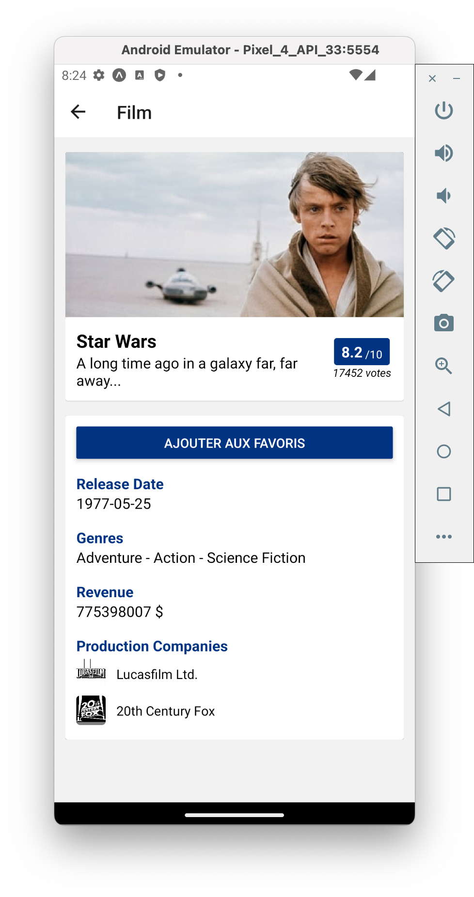

<br/>

<details>
<summary>Correction</summary>

```
//favFilmsSlice.js

import { createSlice } from "@reduxjs/toolkit";

const initialState = {
  favFilmIDs: [],
};

const favFilmsSlice = createSlice({
  name: "favFilms",
  initialState: initialState,
  reducers: {
    favFilm(state, action) {
      state.favFilmIDs.push(action.payload);
    },
    unfavFilm(state, action) {
      state.favFilmIDs = state.favFilmIDs.filter((id) => id !== action.payload);
    },
  },
});

export const { favFilm, unfavFilm } = favFilmsSlice.actions;
export default favFilmsSlice.reducer;

```

```
//config.js

import { configureStore } from "@reduxjs/toolkit";

import favFilmsReducer from "./reducers/favFilmsSlice";

export const store = configureStore({
  reducer: {
    favFilms: favFilmsReducer,
  },
});

```

```
//App.js

import { StatusBar } from "expo-status-bar";
import { StyleSheet } from "react-native";
import { NavigationContainer } from "@react-navigation/native";
import { Provider } from "react-redux";

import Navigation from "./src/navigation/Navigation";
import { store } from "./src/store/config";

export default function App() {
  return (
    <Provider store={store}>
      <NavigationContainer>
        <Navigation />
        <StatusBar style="auto" />
      </NavigationContainer>
    </Provider>
  );
}

const styles = StyleSheet.create({
  container: {
    flex: 1,
    backgroundColor: "#fff",
  },
});

```

```
//Film.js

import React, { useState, useEffect } from "react";
import {
  View,
  StyleSheet,
  Text,
  ActivityIndicator,
  ScrollView,
  Image,
  Button,
} from "react-native";
import { useSelector, useDispatch } from "react-redux";

import DisplayError from "../components/DisplayError";
import ProductionCompanyItem from "../components/ProductionCompanyItem";

import { detailsMovie } from "../api/TMDB";

import { favFilm, unfavFilm } from "../store/reducers/favFilmsSlice";

import Colors from "../definitions/Colors";
import Assets from "../definitions/Assets";

const Film = ({ route }) => {
  const [isLoading, setIsLoading] = useState(true);
  const [film, setFilm] = useState(null);
  const [isError, setIsError] = useState(false);

  //Redux related
  const favFilmIDs = useSelector((state) => state.favFilms.favFilmIDs);
  const dispatch = useDispatch();

  useEffect(() => {
    requestFilm();
  }, []); //Uniquement à l'initialisation

  //Pourrait être directement déclarée dans useEffect
  const requestFilm = async () => {
    try {
      const TMDBDetailsMovieResult = await detailsMovie(route.params.filmID);
      setFilm(TMDBDetailsMovieResult);
      setIsLoading(false);
    } catch (error) {
      setIsError(true);
    }
  };

  const displayFilmBackdrop = () => {
    if (film.backdrop_path) {
      return (
        <Image
          style={styles.filmBackdrop}
          source={{
            uri: `https://image.tmdb.org/t/p/w500/${film.backdrop_path}`,
          }}
        />
      );
    }
    return (
      <View style={styles.containerNoFilmBackdrop}>
        <Image source={Assets.icons.missingIMG} />
      </View>
    );
  };

  const displayProductionCompanies = () => {
    let companiesJSX = [];
    film.production_companies.forEach((company, index) => {
      companiesJSX.push(
        <ProductionCompanyItem key={index} companyData={company} />
      );
    });
    return <View>{companiesJSX}</View>;
  };

  const getGenres = () => {
    let genres = "";
    if (film.genres) {
      film.genres.forEach((genre) => {
        genres += genre.name + " - ";
      });
      genres = genres.slice(0, -3);
    }
    return genres;
  };

  const displayFavButton = () => {
    if (favFilmIDs.includes(film.id)) {
      // Le film est en favoris
      return (
        <Button
          title="Retirer des favoris"
          color={Colors.primary_blue}
          onPress={() => dispatch(unfavFilm(film.id))}
        />
      );
    }
    // Le film n'est pas en favoris
    return (
      <Button
        title="Ajouter aux favoris"
        color={Colors.primary_blue}
        onPress={() => dispatch(favFilm(film.id))}
      />
    );
  };

  return (
    <View style={styles.container}>
      {isError ? (
        <DisplayError message="Impossible de récupérer les données du film" />
      ) : isLoading ? (
        <View style={styles.containerLoading}>
          <ActivityIndicator size="large" />
        </View>
      ) : (
        <ScrollView style={styles.containerScroll}>
          {displayFilmBackdrop()}
          <View style={styles.containerCardTop}>
            <View style={styles.containerHeaderMovie}>
              <Text style={styles.textOriginalTitle}>
                {film.original_title}
              </Text>
              <Text style={styles.textContent}>{film.tagline}</Text>
            </View>
            <View style={styles.containerVotes}>
              <View style={styles.containerVoteAverage}>
                <Text style={styles.textVoteAverage}>{film.vote_average}</Text>
                <Text style={styles.textMaxVote}>/10</Text>
              </View>
              <Text style={styles.textVotesCount}>{film.vote_count} votes</Text>
            </View>
          </View>
          <View style={styles.containerCardBottom}>
            {displayFavButton()}
            <Text style={styles.textInfoName}>Release Date</Text>
            <Text style={styles.textContent}>{film.release_date}</Text>
            <Text style={styles.textInfoName}>Genres</Text>
            <Text style={styles.textContent}>{getGenres()}</Text>
            <Text style={styles.textInfoName}>Revenue</Text>
            <Text style={styles.textContent}>{film.revenue + " $"}</Text>
            <Text style={styles.textInfoName}>Production Companies</Text>
            {displayProductionCompanies()}
          </View>
        </ScrollView>
      )}
    </View>
  );
};

export default Film;

const styles = StyleSheet.create({
  container: {
    flex: 1,
  },
  containerLoading: {
    flex: 1,
    justifyContent: "center",
    alignItems: "center",
  },
  containerScroll: {
    flex: 1,
    paddingHorizontal: 12,
    paddingVertical: 16,
  },
  containerCardTop: {
    elevation: 1,
    borderRadius: 3,
    padding: 12,
    flexDirection: "row",
    backgroundColor: "white",
  },
  containerCardBottom: {
    elevation: 1,
    marginTop: 16,
    borderRadius: 3,
    padding: 12,
    backgroundColor: "white",
  },
  containerHeaderMovie: {
    flex: 4,
    marginRight: 8,
  },
  containerVotes: {
    flex: 1,
    alignItems: "center",
    justifyContent: "center",
  },
  containerVoteAverage: {
    paddingHorizontal: 8,
    paddingVertical: 4,
    backgroundColor: Colors.primary_blue,
    borderRadius: 3,
    flexDirection: "row",
    alignItems: "flex-end",
  },
  containerNoFilmBackdrop: {
    height: 128,
    alignItems: "center",
    justifyContent: "center",
    borderTopLeftRadius: 3,
    borderTopRightRadius: 3,
    backgroundColor: "white",
  },
  filmBackdrop: {
    height: 180,
    backgroundColor: Colors.primary_blue,
    borderTopLeftRadius: 3,
    borderTopRightRadius: 3,
  },
  textOriginalTitle: {
    fontSize: 20,
    fontWeight: "bold",
  },
  textContent: {
    fontSize: 16,
  },
  textInfoName: {
    fontWeight: "bold",
    color: Colors.primary_blue,
    fontSize: 16,
    marginTop: 16,
  },
  textVoteAverage: {
    color: "white",
    fontWeight: "bold",
    fontSize: 16,
  },
  textMaxVote: {
    fontSize: 12,
    marginLeft: 3,
    color: "white",
  },
  textVotesCount: {
    fontStyle: "italic",
    fontSize: 12,
  },
});

```

</details>

### Améliorations expérience après mise en favoris

Afin d'améliorer la fonctionnalité de mise en favoris, vous pouvez ajouter les deux comportements suivants:

- Affichez un message lorsque l'utilisateur ajoute / retire un film des favoris. Pour cela, je vous invite à utiliser _react-native-root-toast_. C'est toujours une bonne idée d'indiquer qu'une action a été effectuée
- Affichez une icône dans la page de recherche pour démarquer un film en favoris

Résultat attendu:

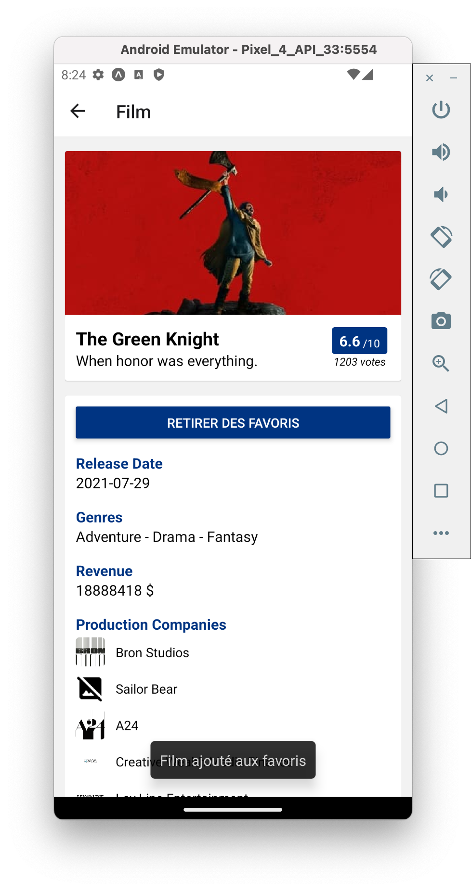
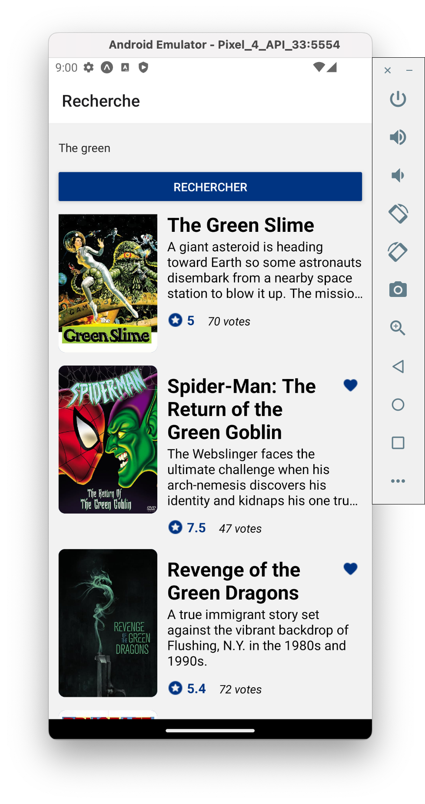
<br/>

<details>
<summary>Correction</summary>

```
//Assets.js

import icon_voteAverage from "../../assets/voteAverage.png";
import icon_error from "../../assets/error.png";
import icon_missingIMG from "../../assets/missingImage.png";
import icon_favFull from "../../assets/favFull.png";

const Assets = {
  icons: {
    voteAverage: icon_voteAverage,
    error: icon_error,
    missingIMG: icon_missingIMG,
    fav: icon_favFull,
  },
};

export default Assets;

```

```
//Film.js

import React, { useState, useEffect } from "react";
import {
  View,
  StyleSheet,
  Text,
  ActivityIndicator,
  ScrollView,
  Image,
  Button,
} from "react-native";
import { useSelector, useDispatch } from "react-redux";
import Toast from "react-native-root-toast";

import DisplayError from "../components/DisplayError";
import ProductionCompanyItem from "../components/ProductionCompanyItem";

import { detailsMovie } from "../api/TMDB";

import { favFilm, unfavFilm } from "../store/reducers/favFilmsSlice";

import Colors from "../definitions/Colors";
import Assets from "../definitions/Assets";

const Film = ({ route }) => {
  const [isLoading, setIsLoading] = useState(true);
  const [film, setFilm] = useState(null);
  const [isError, setIsError] = useState(false);

  //Redux related
  const favFilmIDs = useSelector((state) => state.favFilms.favFilmIDs);
  const dispatch = useDispatch();

  useEffect(() => {
    requestFilm();
  }, []); //Uniquement à l'initialisation

  //Pourrait être directement déclarée dans useEffect
  const requestFilm = async () => {
    try {
      const TMDBDetailsMovieResult = await detailsMovie(route.params.filmID);
      setFilm(TMDBDetailsMovieResult);
      setIsLoading(false);
    } catch (error) {
      setIsError(true);
    }
  };

  const displayFilmBackdrop = () => {
    if (film.backdrop_path) {
      return (
        <Image
          style={styles.filmBackdrop}
          source={{
            uri: `https://image.tmdb.org/t/p/w500/${film.backdrop_path}`,
          }}
        />
      );
    }
    return (
      <View style={styles.containerNoFilmBackdrop}>
        <Image source={Assets.icons.missingIMG} />
      </View>
    );
  };

  const displayProductionCompanies = () => {
    let companiesJSX = [];
    film.production_companies.forEach((company, index) => {
      companiesJSX.push(
        <ProductionCompanyItem key={index} companyData={company} />
      );
    });
    return <View>{companiesJSX}</View>;
  };

  const getGenres = () => {
    let genres = "";
    if (film.genres) {
      film.genres.forEach((genre) => {
        genres += genre.name + " - ";
      });
      genres = genres.slice(0, -3);
    }
    return genres;
  };

  const displayFavButton = () => {
    if (favFilmIDs.includes(film.id)) {
      // Le film est en favoris
      return (
        <Button
          title="Retirer des favoris"
          color={Colors.primary_blue}
          onPress={() => {
            dispatch(unfavFilm(film.id));
            Toast.show("Film retiré des favoris", {
              duration: Toast.durations.LONG,
            });
          }}
        />
      );
    }
    // Le film n'est pas en favoris
    return (
      <Button
        title="Ajouter aux favoris"
        color={Colors.primary_blue}
        onPress={() => {
          dispatch(favFilm(film.id));
          Toast.show("Film ajouté aux favoris", {
            duration: Toast.durations.LONG,
          });
        }}
      />
    );
  };

  return (
    <View style={styles.container}>
      {isError ? (
        <DisplayError message="Impossible de récupérer les données du film" />
      ) : isLoading ? (
        <View style={styles.containerLoading}>
          <ActivityIndicator size="large" />
        </View>
      ) : (
        <ScrollView style={styles.containerScroll}>
          {displayFilmBackdrop()}
          <View style={styles.containerCardTop}>
            <View style={styles.containerHeaderMovie}>
              <Text style={styles.textOriginalTitle}>
                {film.original_title}
              </Text>
              <Text style={styles.textContent}>{film.tagline}</Text>
            </View>
            <View style={styles.containerVotes}>
              <View style={styles.containerVoteAverage}>
                <Text style={styles.textVoteAverage}>{film.vote_average}</Text>
                <Text style={styles.textMaxVote}>/10</Text>
              </View>
              <Text style={styles.textVotesCount}>{film.vote_count} votes</Text>
            </View>
          </View>
          <View style={styles.containerCardBottom}>
            {displayFavButton()}
            <Text style={styles.textInfoName}>Release Date</Text>
            <Text style={styles.textContent}>{film.release_date}</Text>
            <Text style={styles.textInfoName}>Genres</Text>
            <Text style={styles.textContent}>{getGenres()}</Text>
            <Text style={styles.textInfoName}>Revenue</Text>
            <Text style={styles.textContent}>{film.revenue + " $"}</Text>
            <Text style={styles.textInfoName}>Production Companies</Text>
            {displayProductionCompanies()}
          </View>
        </ScrollView>
      )}
    </View>
  );
};

export default Film;

const styles = StyleSheet.create({
  container: {
    flex: 1,
  },
  containerLoading: {
    flex: 1,
    justifyContent: "center",
    alignItems: "center",
  },
  containerScroll: {
    flex: 1,
    paddingHorizontal: 12,
    paddingVertical: 16,
  },
  containerCardTop: {
    elevation: 1,
    borderRadius: 3,
    padding: 12,
    flexDirection: "row",
    backgroundColor: "white",
  },
  containerCardBottom: {
    elevation: 1,
    marginTop: 16,
    borderRadius: 3,
    padding: 12,
    backgroundColor: "white",
  },
  containerHeaderMovie: {
    flex: 4,
    marginRight: 8,
  },
  containerVotes: {
    flex: 1,
    alignItems: "center",
    justifyContent: "center",
  },
  containerVoteAverage: {
    paddingHorizontal: 8,
    paddingVertical: 4,
    backgroundColor: Colors.primary_blue,
    borderRadius: 3,
    flexDirection: "row",
    alignItems: "flex-end",
  },
  containerNoFilmBackdrop: {
    height: 128,
    alignItems: "center",
    justifyContent: "center",
    borderTopLeftRadius: 3,
    borderTopRightRadius: 3,
    backgroundColor: "white",
  },
  filmBackdrop: {
    height: 180,
    backgroundColor: Colors.primary_blue,
    borderTopLeftRadius: 3,
    borderTopRightRadius: 3,
  },
  textOriginalTitle: {
    fontSize: 20,
    fontWeight: "bold",
  },
  textContent: {
    fontSize: 16,
  },
  textInfoName: {
    fontWeight: "bold",
    color: Colors.primary_blue,
    fontSize: 16,
    marginTop: 16,
  },
  textVoteAverage: {
    color: "white",
    fontWeight: "bold",
    fontSize: 16,
  },
  textMaxVote: {
    fontSize: 12,
    marginLeft: 3,
    color: "white",
  },
  textVotesCount: {
    fontStyle: "italic",
    fontSize: 12,
  },
});

```

```
//App.js

import { StatusBar } from "expo-status-bar";
import { StyleSheet } from "react-native";
import { NavigationContainer } from "@react-navigation/native";
import { Provider } from "react-redux";
import { RootSiblingParent } from "react-native-root-siblings";

import Navigation from "./src/navigation/Navigation";
import { store } from "./src/store/config";

export default function App() {
  return (
    <RootSiblingParent>
      <Provider store={store}>
        <NavigationContainer>
          <Navigation />
          <StatusBar style="auto" />
        </NavigationContainer>
      </Provider>
    </RootSiblingParent>
  );
}

const styles = StyleSheet.create({
  container: {
    flex: 1,
    backgroundColor: "#fff",
  },
});

```

```
//FilmListItem.js

import React from "react";
import { View, StyleSheet, Image, Text, TouchableOpacity } from "react-native";
import PropTypes from "prop-types";

import Assets from "../definitions/Assets";
import Colors from "../definitions/Colors";

const FilmListItem = ({
  filmData: { original_title, overview, vote_average, vote_count, poster_path },
  onClick,
  isHighlighted,
}) => {
  const getPoster = () => {
    if (poster_path) {
      return (
        <Image
          style={styles.poster}
          source={{ uri: `https://image.tmdb.org/t/p/w500/${poster_path}` }}
        />
      );
    }
    return (
      <View style={styles.noPoster}>
        <Image source={Assets.icons.missingIMG} />
      </View>
    );
  };

  return (
    <TouchableOpacity style={styles.container} onPress={onClick}>
      {getPoster()}
      <View style={styles.informationContainer}>
        <View style={styles.titleContainer}>
          <Text style={styles.title}>{original_title}</Text>
          {isHighlighted ? (
            <Image style={styles.highlight} source={Assets.icons.fav} />
          ) : null}
        </View>
        <Text style={styles.overview} numberOfLines={4}>
          {overview}
        </Text>
        <View style={styles.statsContainer}>
          <View style={styles.statContainer}>
            <Image style={styles.icon} source={Assets.icons.voteAverage} />
            <Text style={styles.voteAverage}>{vote_average}</Text>
          </View>
          <View style={styles.statContainer}>
            <Text style={styles.voteCount}>{vote_count} votes</Text>
          </View>
        </View>
      </View>
    </TouchableOpacity>
  );
};

FilmListItem.propTypes = {
  filmData: PropTypes.shape({
    original_title: PropTypes.string,
    overview: PropTypes.string,
    vote_average: PropTypes.number,
    vote_count: PropTypes.number,
    poster_path: PropTypes.string,
  }).isRequired,
  onClick: PropTypes.func.isRequired,
  isHighlighted: PropTypes.bool.isRequired,
};

export default FilmListItem;

const styles = StyleSheet.create({
  container: {
    flexDirection: "row",
    paddingVertical: 8,
  },
  informationContainer: {
    flex: 1,
    marginLeft: 12,
    marginTop: 8,
  },
  statsContainer: {
    flexDirection: "row",
    marginTop: 12,
  },
  titleContainer: {
    flexDirection: "row",
  },
  statContainer: {
    flexDirection: "row",
    alignItems: "center",
    marginRight: 16,
  },
  poster: {
    width: 120,
    height: 180,
    borderRadius: 8,
    backgroundColor: Colors.primary_blue,
  },
  noPoster: {
    width: 120,
    height: 180,
    alignItems: "center",
    justifyContent: "center",
  },
  title: {
    fontSize: 24,
    fontWeight: "bold",
    flex: 1,
  },
  voteAverage: {
    fontSize: 16,
    fontWeight: "bold",
    color: Colors.primary_blue,
  },
  voteCount: {
    fontSize: 14,
    alignSelf: "flex-end",
    fontStyle: "italic",
  },
  overview: {
    fontSize: 16,
  },
  icon: {
    tintColor: Colors.primary_blue,
    width: 20,
    height: 20,
    marginRight: 4,
  },
  highlight: {
    tintColor: Colors.primary_blue,
    width: 20,
    height: 20,
    marginHorizontal: 4,
    marginTop: 6,
  },
});

```

```
//Search.js

import React, { useState } from "react";
import {
  View,
  TextInput,
  Button,
  StyleSheet,
  FlatList,
  Keyboard,
} from "react-native";
import { useSelector } from "react-redux";

import FilmListItem from "../components/FilmListItem";
import DisplayError from "./DisplayError";

import Colors from "../definitions/Colors";
import { searchMovie } from "../api/TMDB";

const Search = ({ navigation }) => {
  const [films, setFilms] = useState([]);
  const [searchTerm, setSearchTerm] = useState("");
  const [currentPage, setCurrentPage] = useState(1);
  const [isMorePages, setIsMorePages] = useState(true);
  const [isRefreshing, setIsRefreshing] = useState(false);
  const [isError, setIsError] = useState(false);

  const favFilmIDs = useSelector((state) => state.favFilms.favFilmIDs);

  const searchFilms = async (currentFilms, pageToRequest) => {
    setIsRefreshing(true);
    setIsError(false);
    console.log(
      "Search Movies; previously " +
        currentFilms.length +
        " films and will request page n° " +
        pageToRequest
    );
    try {
      const TMDBSearchMovieResult = await searchMovie(
        searchTerm,
        pageToRequest
      );
      setFilms([...currentFilms, ...TMDBSearchMovieResult.results]);
      setCurrentPage(TMDBSearchMovieResult.page);
      TMDBSearchMovieResult.page == TMDBSearchMovieResult.total_pages
        ? setIsMorePages(false)
        : setIsMorePages(true);
    } catch (error) {
      setIsError(true);
      setFilms([]);
      setIsMorePages(true);
      setCurrentPage(1);
    }
    setIsRefreshing(false);
  };

  const newSearchFilms = () => {
    Keyboard.dismiss();
    searchFilms([], 1);
  };

  const loadMoreFilms = () => {
    if (isMorePages) {
      searchFilms(films, currentPage + 1);
    }
  };

  const navigateFilmDetails = (filmID) => {
    navigation.navigate("ViewFilm", { filmID });
  };

  const isFilmFaved = (id) => {
    return favFilmIDs.includes(id);
  };

  return (
    <View style={styles.container}>
      <View style={styles.searchContainer}>
        <TextInput
          placeholder="Terme à chercher"
          style={styles.inputSearchTerm}
          onChangeText={(text) => setSearchTerm(text)}
          onSubmitEditing={newSearchFilms}
        />
        <Button
          title="Rechercher"
          color={Colors.primary_blue}
          onPress={newSearchFilms}
        />
      </View>
      {isError ? (
        <DisplayError message="Impossible de récupérer les films" />
      ) : (
        <FlatList
          data={films}
          keyExtractor={(item) => item.id.toString()}
          renderItem={({ item }) => (
            <FilmListItem
              filmData={item}
              onClick={() => {
                navigateFilmDetails(item.id);
              }}
              isHighlighted={isFilmFaved(item.id)}
            />
          )}
          onEndReached={loadMoreFilms}
          onEndReachedThreshold={0.5}
          refreshing={isRefreshing}
          onRefresh={newSearchFilms}
        />
      )}
    </View>
  );
};

export default Search;

const styles = StyleSheet.create({
  container: {
    flex: 1,
    paddingHorizontal: 12,
    marginTop: 16,
  },
  searchContainer: {
    marginBottom: 16,
  },
  inputSearchTerm: {
    marginBottom: 16,
  },
});

```

</details>

### Conserver les films

Actuellement le store est réinitialisé à chaque démarrage de l'application. Pour conserver l'état du store de Redux nous pouvons utiliser _redux-persist_. Il est basé sur 2 concepts:

- Persist: sauvegarde l'information du store
- Rehydrate: récupère l'information et l'injecte dans le store

Installation (async-storage permet de stocker les données)

```
npm install redux-persist
npm install @react-native-async-storage/async-storage
```

Documentation à regarder:

- [redux-persist GitHub](https://github.com/rt2zz/redux-persist)
- [Redux Toolkit - use with redux-persist](https://redux-toolkit.js.org/usage/usage-guide#use-with-redux-persist)

La prop _loading_ permet de définir un composant à afficher tant que le store n'est pas réhydraté (par exemple, un _ActivityIndicator_). De nombreuses options sont disponibles avec _redux-persist_, je vous encourage à essayer.

**Mettez en place redux-persist dans le projet.**

<details>
<summary>Correction</summary>

```

```

</details>
