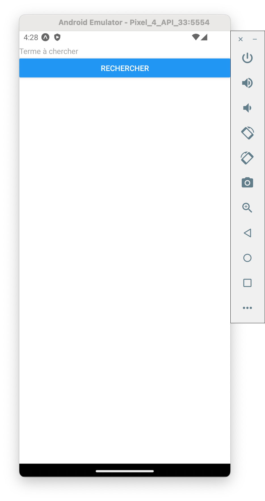
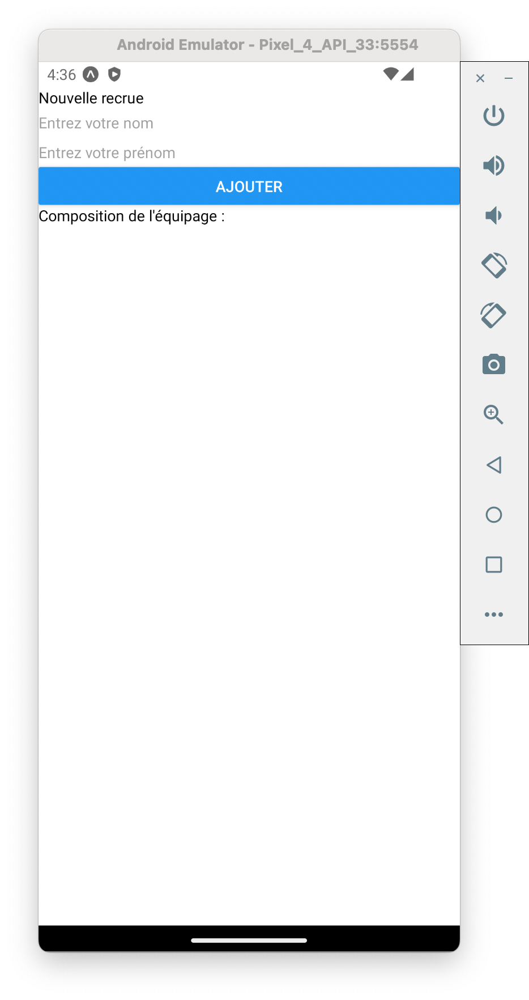
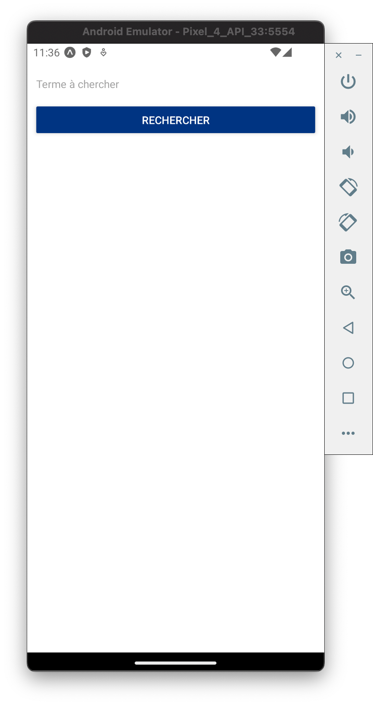
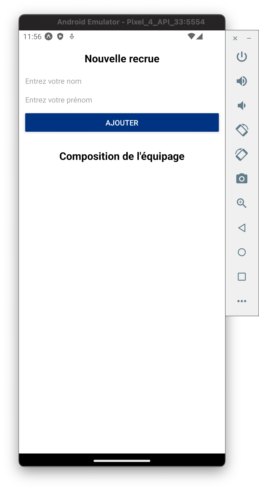
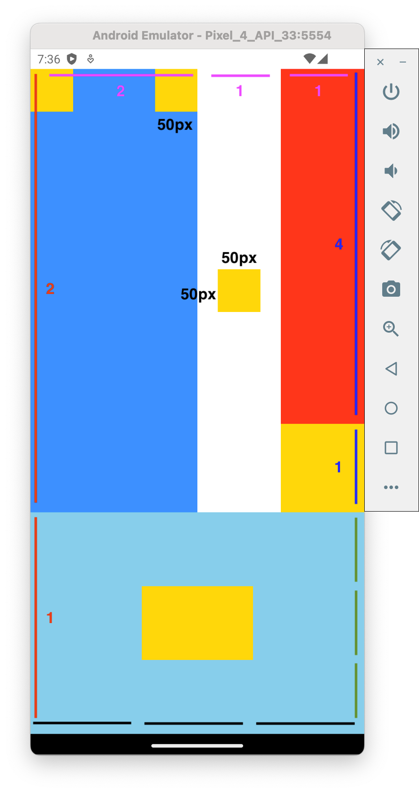
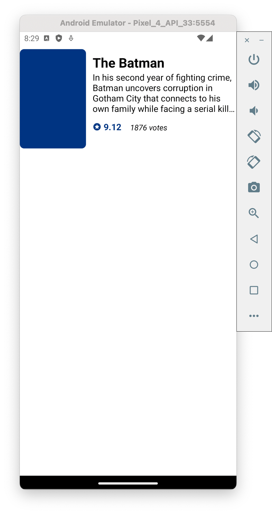
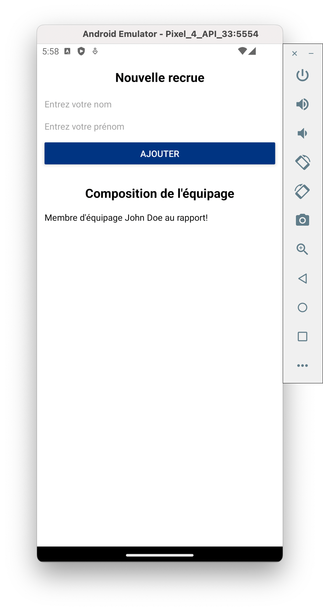
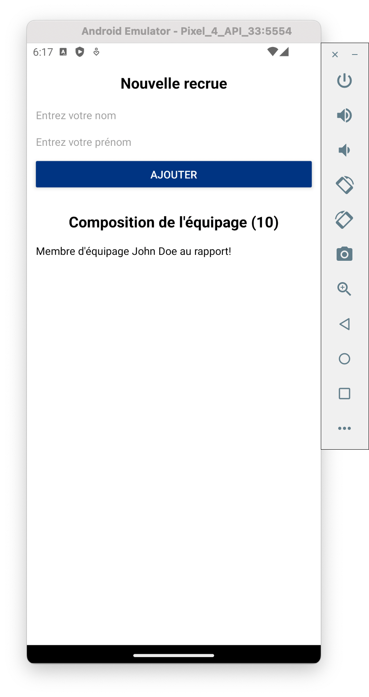

# Liens utiles

[Documentation de React Native](https://reactnative.dev/docs/getting-started)  
[Documentation des composants React Native](https://reactnative.dev/docs/components-and-apis)  
[Documentation Flexbox ReactNative](https://reactnative.dev/docs/flexbox)  
[Documentation de la FlatList React Native](https://reactnative.dev/docs/flatlist)  
[Documentation des Hooks](https://fr.reactjs.org/docs/hooks-intro.html)  
[Documentation de react-navigation](https://reactnavigation.org/docs/en/getting-started.html)  
[Documentation API Fetch](https://developer.mozilla.org/fr/docs/Web/API/Fetch_API/Using_Fetch)

[Feuille récap des propriétés pour les styles](https://github.com/vhpoet/react-native-styling-cheat-sheet)

# Get started - CRNA

## Les outils

Installez [Node.js (LTS).](https://nodejs.org/en/download/)

Installez **Expo**:

```
npm install -g expo-cli
```

Installez un **éditeur de texte** pour développer en JavaScript. Je recommande Visual Studio Code mais vous êtes libre de choisir une autre solution (Atom, IntelliJ...).

Si vous êtes sur macOS, il vous faudra également [installer Watchman](https://facebook.github.io/watchman/docs/install#buildinstall).

Sur votre téléphone / tablette, téléchargez **l'application Expo**.
Passez le téléphone en mode développeur.  
Si vous souhaitez utiliser un émulateur Android, installez Android Studio. Vous pouvez suivre [ce tutoriel](https://docs.expo.dev/workflow/android-studio-emulator/) pour configurer votre émulateur.

## Création du projet

Initialisez votre projet (template blank):

```
expo init nomdudossier
```

## Lancer l'application

Placez-vous dans un terminal, dans le dossier de votre projet:

```
expo start
```

Si vous êtes sur le même réseau WiFi, scannez le QR code avec Expo depuis la tablette. Sinon passez en mode tunnel dans l'interface web ouverte par Expo, puis scannez le QR code.

## Menu des options de debug

Pour ouvrir le menu d'options de debug, secouez l'appareil.

## Live reloading

Pas besoin de compiler du JS. Une application React Native se recharge dès que vous faites un changement.

Dans le fichier _App.js_, modifiez:

```
<Text>Open up App.js to start working on your app!</Text>
```

par:

```
<Text>Bonjour à vous les GI</Text>
```

puis sauvegardez. L'application est re-rendu et le changement s'affiche à l'écran.

# Application

## Premier composant

Objectif, réaliser ce composant:



Par convention et réutilisabilité:

- 1 composant = 1 fichier
- nom du fichier contenant un composant commence par une majuscule

Créez un dossier _src_, puis un dossier _components_, puis le fichier _Search.js_ (src/components/Search.js).

Il existe 2 façons pour écrire un composant: l'écrire sous forme de **class** ou sous forme de **function**. Voici un _Hello World_ représentant ces 2 méthodes:

```
//Class

import React, { Component } from 'react';
import { Text, View } from 'react-native';

class HelloWorldApp extends Component {
  render() {
    return (
      <View>
        <Text>Hello, world!</Text>
      </View>
    );
  }
}

export default HelloWorldApp;
```

```
//Function

import React from 'react';
import { Text, View } from 'react-native';

const HelloWorldApp = () => {
  return (
    <View>
      <Text>Hello, world!</Text>
    </View>
  );
}

export default HelloWorldApp;
```

Bien que la forme de class doit être plus familière, cette méthode est déconseillée depuis l'introduction des **Hooks** en mars 2019. Nous verrons cela plus tard, prennez donc l'habitude d'écrire vos composants sous forme de functions.

Notez également l'utilisation d'une **arrow function**:

```
//Function

function myFunction () {
  return 'Hello';
}
```

```
//Arrow function

const myArrowFunction = () => {
  return 'Hello';
}
```

C'est une autre façon d'écrire les fonctions en JS, avec quelques subtilités comme la syntaxe, le contexte ou le passage d'arguments.  
Pour l'instant utiliser une _function_ ou une _arrow function_ ne change rien, mais par la suite cela aura un impact. Par défaut, utilisez **toujours des _arrow functions_ pour écrire vos composants.**

N'oubliez pas d'importer les composants React et React native en premiers dans vos composants. React Native exporte ses composants dans un seul fichier 'react-native'.

```
import React from 'react';
import { View, TextInput, Button } from 'react-native';
```

Il faut maintenant décrire le contenu de notre composant:

```
return (
  <View>
    <TextInput placeholder='Terme à chercher'/>
    <Button
      title='Rechercher'
      onPress={() => { console.log('Coucou'); }}
    />
  </View>
);
```

La propriété _onPress_ attend une fonction à exécuter lors d'un appui sur le bouton. J'ai ici utilisé l'avantage syntaxique des arrow functions, mais j'aurais pu écrire:

```
maFonction = function() {
  console.log('Coucou');
};

...
    <Button
      title='Rechercher'
      onPress={maFonction}
    />
...
```

On termine par exporter notre composant pour l'utiliser dans l'application:

```
export default Search;
```

Import et utilisation dans App.js:

```
import Search from './src/components/Search';

export default function App() {
  return (
    <View style={styles.container}>
      <Search />
      <StatusBar style="auto" />
    </View>
  );
}
```

<details>
<summary>Code complet</summary>

```
//Search.js

import React from 'react';
import { View, TextInput, Button } from 'react-native';

const Search = () => {
  return (
    <View>
      <TextInput
        placeholder="Terme à chercher" />
      <Button
        title="Rechercher"
        onPress={() => { console.log('Coucou'); }} />
    </View>
  );
};

export default Search;
```

```
//App.js

import { StatusBar } from 'expo-status-bar';
import { StyleSheet, View } from 'react-native';

import Search from './src/components/Search';

export default function App() {
  return (
    <View style={styles.container}>
      <Search />
      <StatusBar style="auto" />
    </View>
  );
}

const styles = StyleSheet.create({
  container: {
    flex: 1,
    backgroundColor: '#fff',
    marginTop: 24, // correction barre d'état
  },
});
```

</details>
<br>

Après sauvegarde des fichiers, vous pouvez observer le résultat directement sur votre appareil. J'ai corrigé le soucis avec la barre d'état dans le _style_ du fichier App.js, on verra cela plus tard.

### Exercice: s'entrainer sur un composant custom

Créez un nouveau composant Test.js et faite en sorte d'obtenir le résultat suivant:



<details>
<summary>Correction</summary>

```
//Test.js

import React from "react";
import { View, TextInput, Text, Button } from "react-native";

const Test = () => {
  return (
    <View>
      <Text>Nouvelle recrue</Text>
      <TextInput placeholder="Entrez votre nom" />
      <TextInput placeholder="Entrez votre prénom" />
      <Button title="Ajouter" onPress={() => {}} />
      <Text>Composition de l'équipage :</Text>
    </View>
  );
};

export default Test;

```

</details>
<br>

## Maitriser le style

Les styles permettent de contrôler le rendu graphique des composants. Première approche pour ajouter des styles:

```
const Search = () => {
  return (
    <View style={{ paddingHorizontal: 12, marginTop: 16 }}>
      <TextInput placeholder="Terme à chercher" style={{ marginBottom: 16 }} />
      <Button
        title="Rechercher"
        color="#003482"
        onPress={() => {
          console.log("Coucou");
        }}
      />
    </View>
  );
};
```

A noter que le composant Button n'a pas de propriété _style_. Il faut soit utiliser une propriété existante (ici _color_), soit utiliser un autre composant React Native (_ToucheableOpacity_ par exemple).  
Résultat obtenu:



Une bonne pratique, pour améliorer la lisibilité du code, est d'externaliser les styles du composant. Pour cela il faut utiliser _StyleSheet_:

```
import { ..., StyleSheet } from 'react-native';
```

Il faut ensuite définir les styles du composant, en dehors de ce dernier mais dans le même fichier:

```
const styles = StyleSheet.create({
  container: {
    paddingHorizontal: 12,
    marginTop: 16,
  },
  inputSearchTerm: {
    marginBottom: 16,
  },
});
```

Et enfin les appliquer à nos éléments, en utilisant les noms des variables utilisées à l'étape précédente:

```
const Search = () => {
  return (
    <View style={styles.container}>
      <TextInput
        placeholder="Terme à chercher"
        style={styles.inputSearchTerm}
      />
      <Button
        title="Rechercher"
        color="#003482"
        onPress={() => {
          console.log("Coucou");
        }}
      />
    </View>
  );
};
```

**Gérer les couleurs dans l'application**

La couleur de notre bouton est définie dans ce composant, mais nous allons l'utiliser à plusieurs endroits de notre application. Il faudrait définir une variable une seule fois pour pouvoir l'utiliser au besoin.  
Pour cela, créez un fichier pour gérer l'ensemble des couleurs. Commençez par créer un dossier _src/definitions_ puis un fichier _Colors.js_. Dans ce dernier, créez une variable pour la couleur:

```
//Colors.js

const Colors = {
  primary_blue: "#003482",
};

export default Colors;

```

Il vous reste à importer le fichier dans le composant pour pouvoir utiliser la couleur:

```
...
import Colors from '../definitions/Colors';
...
      <Button
        title="Rechercher"
        color={Colors.primary_blue}
        onPress={() => {
          console.log("Coucou");
        }}
      />
...
```

<details>
<summary>Code complet</summary>

```
//Search.js

import React from "react";
import { View, TextInput, Button, StyleSheet } from "react-native";

import Colors from "../definitions/Colors";

const Search = () => {
  return (
    <View style={styles.container}>
      <TextInput
        placeholder="Terme à chercher"
        style={styles.inputSearchTerm}
      />
      <Button
        title="Rechercher"
        color={Colors.primary_blue}
        onPress={() => {
          console.log("Coucou");
        }}
      />
    </View>
  );
};

export default Search;

const styles = StyleSheet.create({
  container: {
    paddingHorizontal: 12,
    marginTop: 16,
  },
  inputSearchTerm: {
    marginBottom: 16,
  },
});

```

</details>
<br>

### Exercice: ajouter un style au composant custom

Reprenez le composant _Test.js_ et affichez le résultat suivant:



<details>
<summary>Correction</summary>

```
//Test.js
import React from "react";
import { View, TextInput, Text, Button, StyleSheet } from "react-native";

import Colors from "../definitions/Colors";

const Test = () => {
  return (
    <View style={styles.container}>
      <View style={styles.subContainer}>
        <Text style={styles.title}>Nouvelle recrue</Text>
        <TextInput placeholder="Entrez votre nom" style={styles.form} />
        <TextInput
          placeholder="Entrez votre prénom"
          style={[styles.form, { marginBottom: 12 }]}
        />
        <Button
          title="Ajouter"
          color={Colors.primary_blue}
          onPress={() => {}}
        />
      </View>
      <View style={styles.subContainer}>
        <Text style={styles.title}>Composition de l'équipage</Text>
      </View>
    </View>
  );
};

export default Test;

const styles = StyleSheet.create({
  container: {
    marginHorizontal: 12,
  },
  subContainer: {
    paddingVertical: 16,
  },
  title: {
    alignSelf: "center",
    fontSize: 20,
    fontWeight: "bold",
    marginBottom: 16,
  },
  form: {
    marginBottom: 8,
  },
});

```

</details>
<br>

### Exercice: Flexbox

Rappel: Flexbox sert à définir le comportement des composants pour gérer leur taille. C'est nottamment utile pour ajouter une dimension dynamique à l'espace pris par chacun des éléments de l'interface graphique.  
La documentation de Flexbox est [disponible ici.](https://reactnative.dev/docs/flexbox)

Créez un composant _Test2.js_ et affichez le résultat çi-dessous. Pensez à visualiser le squelette de l'écran, les _boîtes dans les boîtes_.



<details>
<summary>Correction</summary>

```
//Test2.js

import React from "react";
import { View, StyleSheet } from "react-native";

const Test2 = () => {
  return (
    <View style={styles.mainView}>
      <View style={styles.topView}>
        <View style={styles.topSecondaryFirstView}>
          <View style={styles.topBoxViews} />
          <View style={styles.topBoxViews} />
        </View>
        <View style={styles.topSecondarySecView}>
          <View style={styles.topBoxViews} />
        </View>
        <View style={styles.topSecondaryThirdView}>
          <View style={{ flex: 4 }} />
          <View style={{ flex: 1, backgroundColor: "gold" }} />
        </View>
      </View>

      <View style={styles.bottomView}>
        <View style={styles.bottomSecondaryViews} />
        <View style={styles.bottomSecondaryViews}>
          <View style={styles.bottomThirdViews} />
          <View
            style={[styles.bottomThirdViews, { backgroundColor: "gold" }]}
          />
          <View style={styles.bottomThirdViews} />
        </View>
        <View style={styles.bottomSecondaryViews} />
      </View>
    </View>
  );
};

export default Test2;

const styles = StyleSheet.create({
  mainView: { flex: 1 },
  topView: {
    flex: 2,
    flexDirection: "row",
  },
  topSecondaryFirstView: {
    flex: 2,
    backgroundColor: "dodgerblue",
    flexDirection: "row",
    justifyContent: "space-between",
  },
  topSecondarySecView: {
    flex: 1,
    backgroundColor: "white",
    alignItems: "center",
    justifyContent: "center",
  },
  topSecondaryThirdView: {
    flex: 1,
    backgroundColor: "red",
    justifyContent: "flex-end",
  },
  topBoxViews: {
    height: 50,
    width: 50,
    backgroundColor: "gold",
  },
  bottomView: {
    flex: 1,
    flexDirection: "row",
  },
  bottomSecondaryViews: {
    flex: 1,
    backgroundColor: "skyblue",
  },
  bottomThirdViews: {
    flex: 1,
    backgroundColor: "skyblue",
  },
});

```

</details>
<br>

## Liste d'aperçu des films

### Exercice: composant pour afficher l'aperçu d'un film

Vous allez mettre en application ce que vous avez vu pour construire le composant qui affiche quelques informations sur un film. Créez un nouveau composant _FilmListItem_ avec comme rendu:



Quelques infos pour vous guider:

- taille de l'affiche du film: 120 / 180; borderRadius: 8
- taille de l'icône: 20 / 20
- taille de la police du nom du film: 24; overview: 16; note: 16; nombre de votes: 14
- numberOfLines={ 4 } pour l'overview permet de forcer le texte à s'afficher sur 4 lignes maximum et sera coupé avec "..." si plus long

Pour les icônes et le poster du film, utilisez le composant _Image_ de react. Pour charger l'élément à afficher, le composant demande une propriété _source_ (le chemin); dans le cas du poster ne l'utilisez pas pour le moment. Pour les icônes, créez un fichier _src/definitions/Assets.js_ pour en centraliser la gestion:

```
//Asset.js
import icon_voteAverage from "../../assets/voteAverage.png";
const Assets = {
  icons: {
    voteAverage: icon_voteAverage,
  },
};
export default Assets;
```

<details>
<summary>Correction</summary>

```
//FilmListItem.js

import React from "react";
import { View, StyleSheet, Image, Text } from "react-native";

import Assets from "../definitions/Assets";
import Colors from "../definitions/Colors";

const FilmListItem = () => (
  <View style={styles.container}>
    <Image style={styles.poster} />
    <View style={styles.informationContainer}>
      <Text style={styles.title}>The Batman</Text>
      <Text style={styles.overview} numberOfLines={4}>
        In his second year of fighting crime, Batman uncovers corruption in
        Gotham City that connects to his own family while facing a serial killer
        known as the Riddler.
      </Text>
      <View style={styles.statsContainer}>
        <View style={styles.statContainer}>
          <Image style={styles.icon} source={Assets.icons.voteAverage} />
          <Text style={styles.voteAverage}>9.12</Text>
        </View>
        <View style={styles.statContainer}>
          <Text style={styles.voteCount}>1876 votes</Text>
        </View>
      </View>
    </View>
  </View>
);

export default FilmListItem;

const styles = StyleSheet.create({
  container: {
    flexDirection: "row",
    paddingVertical: 8,
  },
  informationContainer: {
    flex: 1,
    marginLeft: 12,
    marginTop: 8,
  },
  statsContainer: {
    flexDirection: "row",
    marginTop: 12,
  },
  statContainer: {
    flexDirection: "row",
    alignItems: "center",
    marginRight: 16,
  },
  poster: {
    width: 120,
    height: 180,
    borderRadius: 8,
    backgroundColor: Colors.primary_blue,
  },
  title: {
    fontSize: 24,
    fontWeight: "bold",
  },
  voteAverage: {
    fontSize: 16,
    fontWeight: "bold",
    color: Colors.primary_blue,
  },
  voteCount: {
    fontSize: 14,
    alignSelf: "flex-end",
    fontStyle: "italic",
  },
  overview: {
    fontSize: 16,
  },
  icon: {
    tintColor: Colors.primary_blue,
    width: 20,
    height: 20,
    marginRight: 4,
  },
});


```

</details>
<br>

### Les propriétés (props) des composants

Rappel: le _destructuring_ permet de déclarer la liste des propriétés attendues dans le composant et d'assigner le contenu dans une variable:

```
const Cat = ({name}) => {
  return (
    <View>
      <Text>
        Je suis {name}!
      </Text>
    </View>
  );
}
const App = () => {
  return (
    <View>
      <Cat name="Kiki"/>
    </View>
  );
}
```

Il est également possible de mettre une valeur par défaut à la propriété:

```
const Cat = ({name="Chichi"}) => {
  ...
const App = () => {
  return (
    <View>
      <Cat />
    </View>
  );
}
```

Il est conseillé de déclarer le type des propriétés attendu pour chaque composant, si la propriété est obligatoire ou non... Des extensions connues de JS comme TypeScript peuvent être utilisées. React possède également sa solution avec **PropTypes**:

```
//A ajouter au projet avec la commande npm install --save prop-types
import PropTypes from "prop-types";
const Cat = ({name}) => {
  ...
}
Cat.propTypes = {
  name: PropTypes.string,
};
```

### Exercice: utiliser des props dans le formulaire de test

Dans la page de test _Test.js_, créez un nouveau composant _CrewMember_ (oui, j'ai conseillé de toujours avoir 1 fichier = 1 composant, j'admets ne pas toujours suivre mes propres règles). Ce dernier va nous servir à afficher le nom et le prénom d'un membre d'équipage. Pour le moment, pas d'interraction entre les champs de saisie du composant _Test_ et de ce nouveau composant (passez simplement le nom et le prénom comme propriété):

```
//Test.js
const CrewMember = ... {
  ...
};
const Test = ...
  <Text style={styles.title}>
    Composition de l'équipage
  </Text>
  <CrewMember firstName="John" lastName="Doe" />
...
```

Résultat attendu :


<br>

<details>
<summary>Correction</summary>

```
//Test.js

import React from "react";
import PropTypes from "prop-types";
import { View, TextInput, Text, Button, StyleSheet } from "react-native";

import Colors from "../definitions/Colors";

const CrewMember = ({ firstName, lastName }) => {
  return (
    <View>
      <Text>
        Membre d'équipage {firstName} {lastName} au rapport!
      </Text>
    </View>
  );
};

CrewMember.propTypes = {
  firstName: PropTypes.string,
  lastName: PropTypes.string,
};

const Test = () => {
  return (
    <View style={styles.container}>
      <View style={styles.subContainer}>
        <Text style={styles.title}>Nouvelle recrue</Text>
        <TextInput placeholder="Entrez votre nom" style={styles.form} />
        <TextInput
          placeholder="Entrez votre prénom"
          style={[styles.form, { marginBottom: 12 }]}
        />
        <Button
          title="Ajouter"
          color={Colors.primary_blue}
          onPress={() => {}}
        />
      </View>
      <View style={styles.subContainer}>
        <Text style={styles.title}>Composition de l'équipage</Text>
        <CrewMember firstName="John" lastName="Doe" />
      </View>
    </View>
  );
};

export default Test;

const styles = StyleSheet.create({
  container: {
    marginHorizontal: 12,
  },
  subContainer: {
    paddingVertical: 16,
  },
  title: {
    alignSelf: "center",
    fontSize: 20,
    fontWeight: "bold",
    marginBottom: 16,
  },
  form: {
    marginBottom: 8,
  },
});


```

</details>
<br>

### Le state des composants

Rappel: le state représente la "base de données" du composant. Lorsque le state change, le composant va se mettre à jour et forcer un refresh de son interface. **Modifier le state est une opération asynchrone.**  
Utilisation du Hook _useState_ sous la forme:  
const [**Variable**, **Modificateur**] = useState(_ValeurParDéfaut_);

Exemple:

```
import React, { useState } from "react";
import { Button, Text, View } from "react-native";
import React, { useState } from "react";
import { Button, Text, View } from "react-native";
const Test = () => {
  const [name, setName] = useState("Paul");
  const changeName = () => {
    console.log("Current name is : " + name);
    setName("Jean");
    console.log("New name is : " + name);
  }
  return (
    <View>
      <Text>
        I am {name}
      </Text>
      <Button
        title="No, your name is Jean !"
        onPress={changeName}/>
    </View>
  );
}
```

### Exercice: utiliser le state dans le formulaire de test

Nous voulons à terme afficher le nombre de membres d'équipage. Pour l'instant, il s'agit du nombre de fois ou le boutton "Ajouter" a été appuyé. Résultat attendu:


<br>

<details>
<summary>Correction</summary>

```
//Test.js
```

</details>
